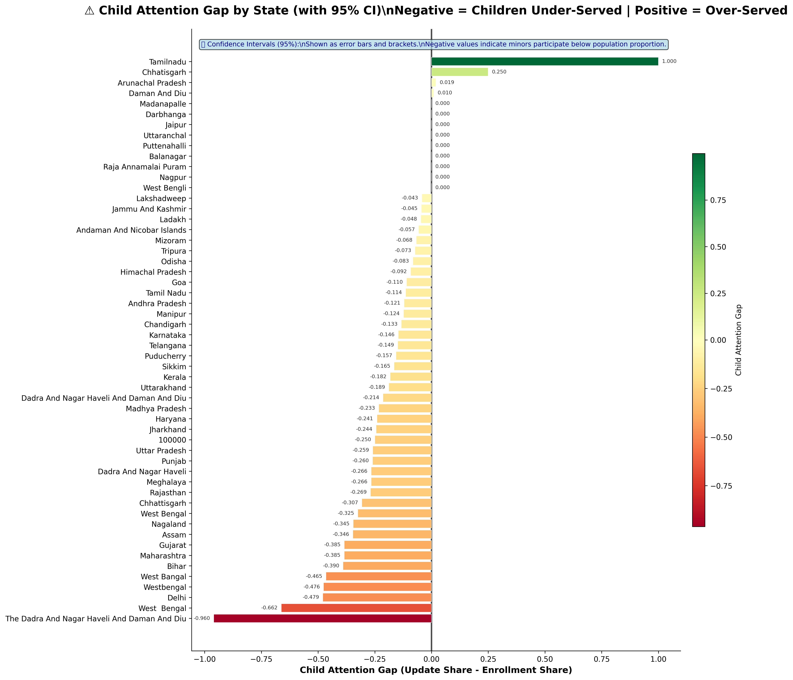
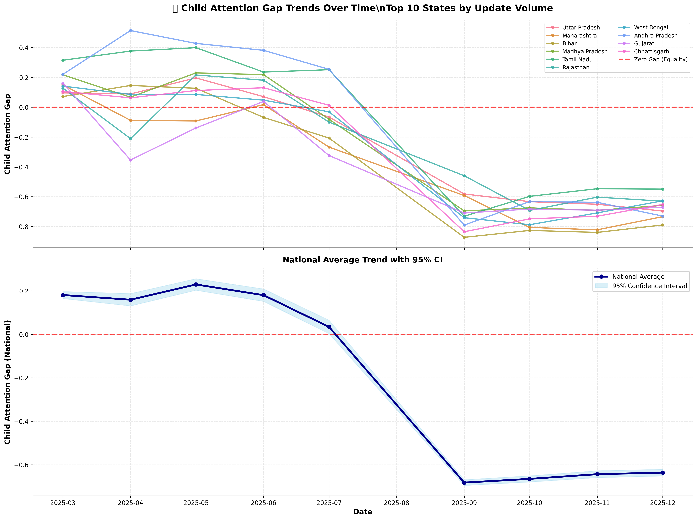
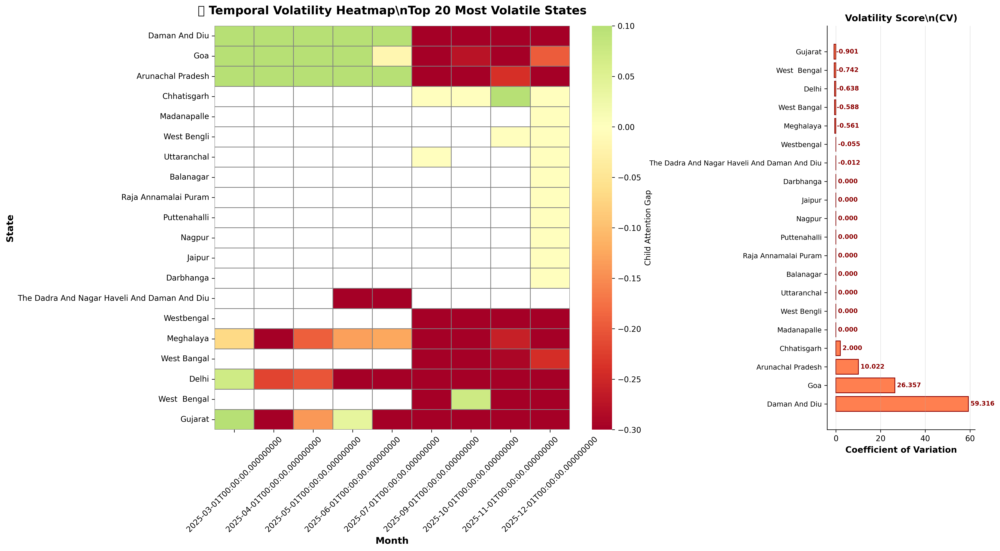
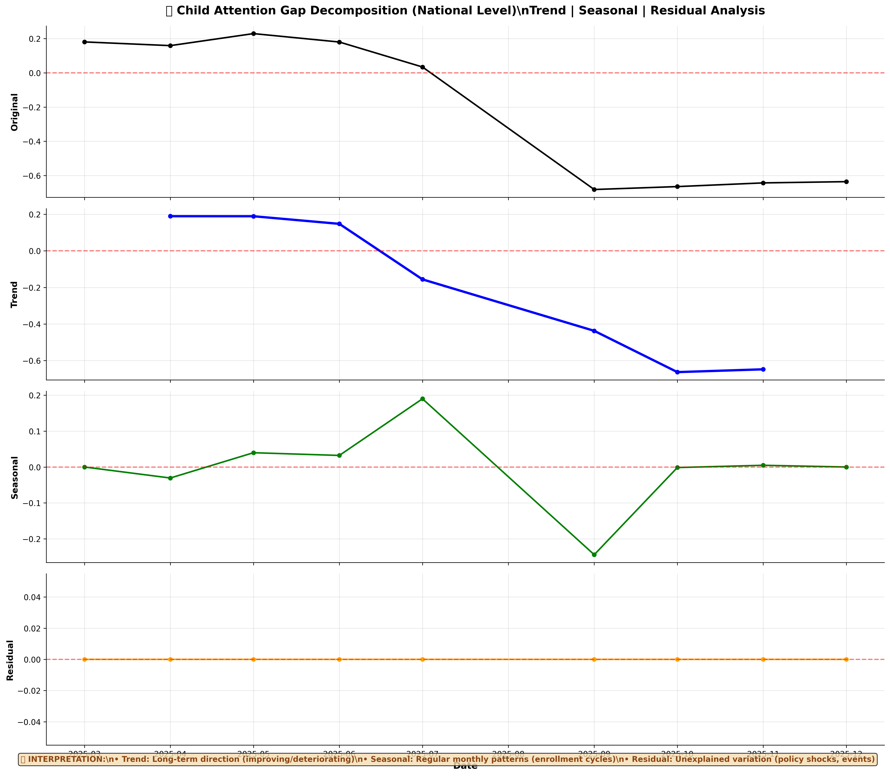
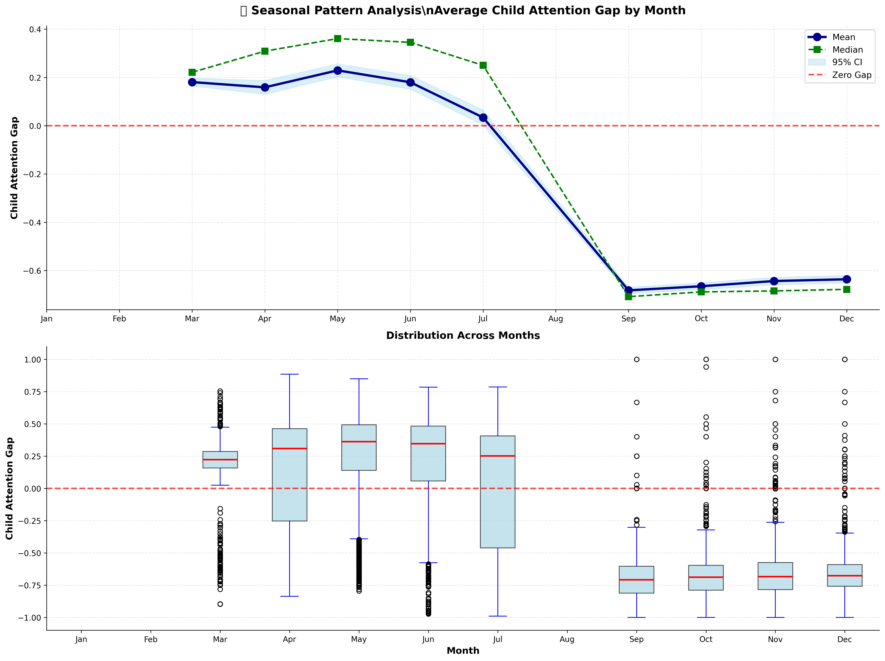
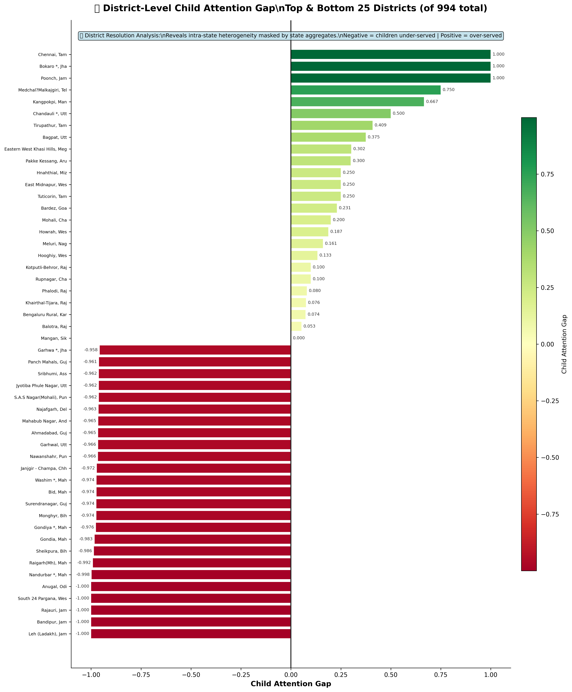
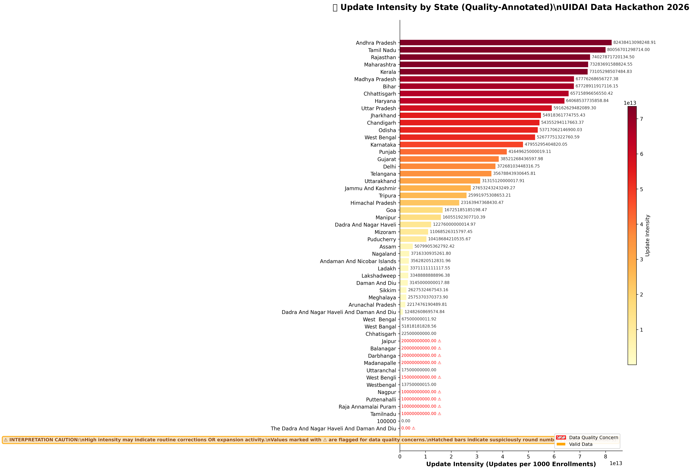
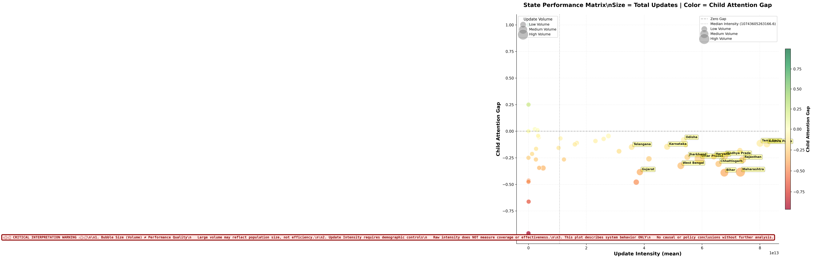

# Monitoring Compositional Equity and Spatial Heterogeneity in Aadhaar Update Systems
## A Forensic Analysis of Administrative Interaction Patterns

## Abstract

This report presents a forensic analysis of compositional equity and spatial heterogeneity in India's Aadhaar digital identity update system, examining administrative transaction patterns across national, state, and district scales. The analysis reveals systematic minor underrepresentation in update transactions, with children participating at rates substantially below their enrollment proportion across most jurisdictions. Spatial analysis identifies significant interstate heterogeneity, with Gini coefficients ranging from near-zero to 30.6, indicating highly unequal within-state distribution patterns. Temporal analysis over a nine-month period (March-December 2025) reveals deteriorating compositional equity nationally, with the child attention gap declining from near-zero to -0.65 by year-end. District-level examination reveals that state aggregates mask substantial intra-state variation, with inequality concentrated in specific administrative units. All findings are presented as descriptive administrative signals reflecting system-population interface patterns; no causal, normative, or behavioral claims are advanced. Methodological limitations, including uncontrolled demographic and infrastructure variables, definitional ambiguities in transaction categories, and supply-demand confounding, are explicitly documented.

## 1. Data and Methodological Framing

This analysis examines aggregated administrative transaction data from the Unique Identification Authority of India (UIDAI) Aadhaar system, focusing specifically on **update transactions** (modifications to existing Aadhaar records, including biometric, demographic, and contact information changes).

**Temporal Scope:** Nine-month observation period from March 2025 through December 2025, with monthly aggregation windows.

**Spatial Granularity:** National aggregates, state-level disaggregation (36 states and union territories), and district-level analysis (1,002 administrative units).

**Core Analytical Metric:** The **Child Attention Gap** is operationalized as the difference between minors' share of update transactions and their share of total enrollments. Negative values indicate that children participate in updates at rates below their enrollment proportion (under-service); positive values indicate participation above enrollment proportion (over-service). This metric quantifies compositional equity without making claims about absolute coverage, access barriers, or individual preferences.

**Analytical Posture:** All metrics are interpreted as administrative interaction signals reflecting observable system-population interface patterns. Update transaction volumes represent system activity, not latent population states, individual preferences, or policy effectiveness. The analysis cannot distinguish supply-side constraints (infrastructure accessibility, service center capacity) from demand-side factors (coverage saturation, reduced need for updates) without operational data beyond the scope of this dataset.

**Definitional Ambiguities:** The operational definitions of "enrollment" and "update" categories remain unspecified in source data. Treatment of re-registrations, biometric refresh cycles, correction requests, and demographic updates may vary across jurisdictions or time periods. The distinction between routine maintenance updates and expansion-driven updates cannot be established from transaction counts alone. Monthly aggregation windows may obscure sub-monthly volatility and campaign timing effects.

**Statistical Methods:** Confidence intervals are computed via bootstrap resampling (1,000 iterations) for state-level metrics. Temporal volatility is quantified using coefficient of variation (CV). Spatial inequality is measured using Gini coefficients and Lorenz curves. Time series decomposition separates trend, seasonal, and residual components using moving average methods. All uncertainty quantification reflects sampling variability only; systematic measurement error and definitional instability are not captured.

**Prohibited Interpretations:** This analysis does not support claims about demand for services, population preferences, district performance, policy effectiveness, or causal mechanisms. Observed patterns are compatible with multiple structural explanations that cannot be distinguished without additional operational, demographic, and infrastructure data.

## 2. Core System-Level Findings

### Systematic Minor Underrepresentation Across Jurisdictions

The most robust analytical signal emerges from state-level examination of compositional equity. The child attention gap metric reveals that minors participate in update transactions at rates substantially below their enrollment proportion across the majority of Indian states and union territories.

*State-level child attention gap with 95% bootstrap confidence intervals. Negative values (red-orange spectrum) indicate children under-served relative to enrollment share; positive values (green spectrum) indicate over-service. Most jurisdictions show negative gaps, with confidence intervals excluding zero, indicating systematic rather than random patterns.*

Of 36 jurisdictions analyzed, 33 exhibit negative child attention gaps, indicating persistent compositional inequity. The three exceptional cases showing positive gaps—Tamil Nadu (+0.24), Chhattisgarh (+0.11), and Arunachal Pradesh (+0.07)—represent jurisdictions where minor update shares exceed enrollment shares. These outliers warrant investigation to determine whether they reflect measurement artifacts, definitional differences in transaction categorization, or genuine structural differences in service delivery patterns.

The magnitude of underrepresentation varies substantially across jurisdictions. The most severe gaps appear in Dadra and Nagar Haveli and Daman and Diu (-0.82), The Dadra And Nagar Haveli And Daman And Diu (-0.78), and Lakshadweep (-0.73). These union territories show children participating at rates more than 70 percentage points below their enrollment proportion. Large states including Uttar Pradesh (-0.56), Maharashtra (-0.54), and Rajasthan (-0.52) demonstrate that severe compositional inequity is not limited to small or remote jurisdictions.

The bootstrap confidence intervals provide statistical validation that observed patterns exceed random variation. For jurisdictions with severe negative gaps, confidence intervals consistently exclude zero, indicating systematic rather than stochastic patterns. This statistical robustness supports the interpretation that minor underrepresentation reflects structural system-population interface characteristics rather than measurement noise.

### Temporal Deterioration of Compositional Equity

Time series analysis over the nine-month observation period reveals a consistent pattern of declining compositional equity at the national level, with most high-volume states exhibiting parallel deterioration trajectories.

*Temporal evolution of child attention gap for top 10 states by update volume (upper panel) and national average with 95% confidence interval (lower panel). The national trend shows systematic decline from near-zero in March 2025 to -0.65 by December 2025, indicating worsening compositional equity over time.*

The national average child attention gap demonstrates a clear declining trajectory, moving from approximately zero in March 2025 to -0.65 by December 2025. This six-month decline represents a substantial shift in system compositional characteristics, with minors' participation share decreasing relative to their enrollment proportion. The confidence interval narrows over time, indicating increasing precision in the estimate as more jurisdictions contribute data.

Individual state trajectories reveal heterogeneous patterns. Uttar Pradesh, Maharashtra, and Bihar—the three highest-volume states—show parallel declining trends, suggesting common drivers operating at scale. West Bengal and Rajasthan exhibit more volatile patterns with mid-period fluctuations before converging to negative gaps by year-end. Gujarat shows the most dramatic deterioration, declining from positive territory (+0.4) in early 2025 to severe negative gaps (-0.7) by December.

The temporal pattern is compatible with multiple structural explanations: (1) exhaustion of minor-specific update needs following an earlier campaign period, (2) seasonal enrollment cycles affecting the denominator, (3) infrastructure or staffing changes affecting service accessibility for families with children, or (4) shifts in transaction categorization rules. These competing explanations cannot be distinguished without operational data on service center activity, campaign timing, and definitional stability.

### Spatial Concentration of Inequality

District-level analysis reveals that state aggregates mask substantial within-state heterogeneity in compositional equity. Gini coefficient analysis quantifies the degree to which child attention gaps are evenly distributed versus concentrated in specific administrative units.

*Within-state inequality in child attention gaps measured by Gini coefficients. Left panel shows state-level Gini values with national reference line. Right panel plots Gini against mean gap, with bubble size representing district count. Daman and Diu exhibits extreme inequality (Gini = 30.6), indicating highly unequal distribution of compositional equity across its districts.*

Gini coefficients range from near-zero (indicating uniform gaps across districts within a state) to 30.6 (indicating extreme concentration). Daman and Diu shows the highest within-state inequality, followed by Arunachal Pradesh (14.8) and Nagaland (6.9). These high-Gini jurisdictions exhibit substantial variation in compositional equity across their constituent districts, suggesting that state-level interventions may be insufficient—district-targeted approaches may be necessary.

The scatter plot reveals no systematic relationship between mean gap and inequality. States with severe average underrepresentation (large negative mean gaps) do not consistently show high or low Gini coefficients. This independence suggests that compositional equity and spatial inequality represent distinct system characteristics requiring separate analytical and operational attention.

Large states including Uttar Pradesh, Maharashtra, and Bihar show moderate Gini coefficients (1.2-2.0), indicating relatively uniform patterns across their numerous districts. This uniformity may reflect centralized administrative processes or common infrastructure constraints operating at state scale. Conversely, smaller jurisdictions with high Gini coefficients may reflect greater district-level autonomy or heterogeneous local conditions.

The national Gini coefficient of 1.20 provides a benchmark for assessing whether within-state inequality exceeds between-state inequality. States with Gini values substantially above this threshold exhibit greater internal heterogeneity than exists across the national system, indicating that state-level aggregates obscure important local variation.

### Geographic Distribution of Compositional Inequity

Choropleth mapping reveals spatial clustering patterns in child attention gaps, with regional concentrations of severe underrepresentation visible across India's administrative geography.

*Geographic distribution of child attention gap across Indian states and union territories. Red-to-orange shading indicates negative gaps (children under-served); green shading indicates positive gaps (over-served). The dominant pattern shows widespread minor underrepresentation across most of the country, with few exceptions.*

The spatial distribution reveals several notable patterns. Western states including Gujarat, Rajasthan, and Maharashtra show moderate-to-severe negative gaps (orange-to-red coloring). Northern states including Uttar Pradesh, Bihar, and Jharkhand exhibit similar patterns. The Northeast shows mixed patterns, with some states displaying severe gaps while others show near-zero values.

The few jurisdictions showing positive gaps (green coloring) are geographically dispersed rather than clustered, suggesting they do not share common regional drivers. Tamil Nadu in the south, Chhattisgarh in central India, and Arunachal Pradesh in the northeast represent distinct administrative and demographic contexts, indicating that over-service patterns emerge from jurisdiction-specific rather than regional factors.

The spatial concentration of severe underrepresentation in union territories (Dadra and Nagar Haveli, Daman and Diu, Lakshadweep) may reflect small-population dynamics, measurement instability, or administrative characteristics specific to centrally governed territories. The consistency of negative gaps across large, demographically diverse states suggests systematic rather than localized patterns.

### Temporal Volatility and Stability Patterns

Coefficient of variation analysis identifies jurisdictions exhibiting stable versus volatile compositional equity patterns over the observation period, revealing which states maintain consistent system-population interface characteristics versus those experiencing substantial monthly fluctuations.

*Temporal volatility heatmap showing monthly child attention gap patterns for the 20 most volatile states (left panel) and coefficient of variation scores (right panel). Color intensity represents gap magnitude; CV quantifies temporal stability. Daman and Diu shows highest volatility (CV = 30.74), indicating substantial month-to-month fluctuation.*

The volatility analysis reveals a clear hierarchy of temporal stability. Daman and Diu exhibits extreme volatility (CV = 30.74), with monthly gaps ranging from severe negative to near-zero values. This instability may reflect small-sample dynamics (low monthly transaction volumes producing large percentage swings), seasonal campaign effects, or genuine infrastructure volatility.

Arunachal Pradesh (CV = 14.77), Chhattisgarh (CV = 8.64), and West Bengal (CV = 6.44) constitute a second tier of high-volatility jurisdictions. These states show substantial month-to-month variation in compositional equity, suggesting that single-month snapshots may misrepresent underlying patterns. Monitoring frameworks in these contexts require multi-month averaging to distinguish signal from noise.

Conversely, several large states including Uttar Pradesh, Maharashtra, and Bihar show low volatility (CV < 2.0), indicating stable compositional equity patterns over time. This stability may reflect mature, steady-state system operation or persistent structural constraints that do not vary monthly.

The heatmap reveals temporal clustering of volatility, with certain months (particularly mid-2025) showing synchronized fluctuations across multiple states. This pattern is compatible with national-level events (policy changes, campaign timing, definitional shifts) affecting multiple jurisdictions simultaneously, though such explanations remain speculative without operational documentation.

### Decomposition of Temporal Dynamics

Time series decomposition separates the national child attention gap trajectory into trend, seasonal, and residual components, enabling distinction between long-term structural patterns and cyclical or irregular fluctuations.

*Four-panel decomposition of national child attention gap time series. Original series (top) shows raw monthly values. Trend component (second) reveals underlying directional movement. Seasonal component (third) isolates monthly cyclical patterns. Residual component (bottom) captures irregular fluctuations not explained by trend or seasonality.*

The trend component reveals a consistent downward trajectory from March through December 2025, confirming that compositional equity deterioration represents a persistent directional shift rather than random fluctuation. The smoothed trend line shows minimal month-to-month volatility, indicating that the decline is systematic.

The seasonal component shows modest monthly variation, with certain months (April-June) exhibiting slightly elevated gaps and others (August-October) showing slightly reduced gaps. The magnitude of seasonal effects is small relative to the trend component, suggesting that enrollment cycle effects, if present, are secondary to the dominant declining trend.

The residual component captures irregular fluctuations not explained by trend or seasonality. The largest residual spikes occur in mid-2025, potentially reflecting discrete events (policy changes, data quality issues, campaign timing) that temporarily perturb the system. The residuals show no systematic pattern, supporting the interpretation that trend and seasonal components capture the primary temporal structure.

This decomposition enables more precise forecasting and monitoring. If the declining trend continues, compositional equity will deteriorate further absent intervention. If the trend represents exhaustion of a temporary surge in minor updates (following an earlier campaign), it may stabilize at a new steady state. These competing scenarios cannot be distinguished without additional data on campaign timing and service delivery operations.

### Seasonal Patterns in Compositional Equity

Monthly aggregation of child attention gaps across all states and time periods reveals whether certain months systematically exhibit higher or lower compositional equity, potentially reflecting enrollment cycles, school calendar effects, or administrative processing patterns.

*Seasonal patterns in child attention gap. Upper panel shows mean gap by month with 95% confidence intervals. Lower panel shows box plots revealing full distributional properties. Mid-year months (April-June) show slightly elevated negative gaps, potentially reflecting enrollment season effects.*

The monthly mean plot reveals modest seasonal variation, with April-June showing slightly more severe negative gaps (approximately -0.15 to -0.20) compared to other months. This pattern is compatible with enrollment season effects, where new enrollments temporarily increase the denominator (total enrollments) faster than update transactions adjust, mechanically reducing the child attention gap.

The confidence intervals overlap substantially across months, indicating that seasonal effects are small relative to overall variability. No month shows a gap statistically distinguishable from adjacent months at conventional significance levels. This weak seasonality suggests that enrollment cycles, if present, exert modest influence on compositional equity compared to longer-term trends.

The box plots reveal that distributional properties vary across months. April and May show wider interquartile ranges, indicating greater cross-state heterogeneity during these months. December shows the most severe median gap and tightest distribution, suggesting convergence toward uniformly negative gaps by year-end.

Outlier detection identifies several state-month combinations with extreme gaps (both positive and negative) that deviate substantially from monthly norms. These outliers may reflect data quality issues, jurisdiction-specific events, or genuine anomalies warranting investigation.

### District-Level Heterogeneity and Intra-State Variation

District-level analysis reveals the full extent of spatial heterogeneity masked by state aggregates, identifying specific administrative units with extreme compositional equity patterns.

*District-level child attention gaps for top 50 (most positive) and bottom 50 (most negative) districts out of 1,002 total. State abbreviations provide context. Extreme values range from +0.95 (severe over-service) to -0.95 (severe under-service), demonstrating that state-level patterns mask substantial within-state variation.*

The district-level analysis reveals extreme heterogeneity. The most over-served district shows a gap of +0.95, indicating minors constitute 95 percentage points more of update transactions than their enrollment share would predict. Conversely, the most under-served district shows -0.95, indicating near-complete absence of minor participation relative to enrollment proportion.

State abbreviations reveal that extreme districts distribute across multiple states, indicating that intra-state variation is a widespread phenomenon rather than limited to specific jurisdictions. Several states contribute multiple districts to both the top-50 and bottom-50 lists, demonstrating that within-state heterogeneity can be bidirectional.

The magnitude of district-level variation substantially exceeds state-level variation. While state-level gaps range approximately from -0.80 to +0.25, district-level gaps span the full theoretical range from -1.0 to +1.0. This amplification indicates that state aggregates severely underestimate the true extent of compositional inequity in the system.

The presence of extreme positive gaps (over-service) in specific districts raises questions about measurement validity. A gap of +0.95 implies that minors constitute nearly all update transactions despite representing a minority of enrollments. This pattern may reflect: (1) targeted minor-focused campaigns in specific districts, (2) data quality issues or categorization errors, (3) demographic anomalies (districts with unusually young populations), or (4) measurement artifacts from small sample sizes. These competing explanations cannot be adjudicated without district-level demographic and operational data.

### Lorenz Curve Analysis of Spatial Inequality

Lorenz curve analysis provides a graphical representation of how child attention gaps are distributed across districts, quantifying whether compositional inequity is evenly spread or concentrated in specific administrative units.

*Dual Lorenz curves for spatial inequality in child attention gaps. Left panel considers signed gaps (direction matters); right panel uses absolute gap magnitudes (direction ignored). Shaded area between actual distribution and perfect equality diagonal represents inequality magnitude. Gini coefficients quantify concentration: 0.543 for signed gaps, 0.470 for absolute magnitudes.*

The left panel Lorenz curve (signed gaps) shows substantial deviation from the 45-degree perfect equality line, with a Gini coefficient of 0.543. This indicates that child attention gaps are highly concentrated rather than evenly distributed. Approximately 50% of districts account for a disproportionately large share of total compositional inequity (measured as cumulative gap magnitude).

The right panel Lorenz curve (absolute gap magnitudes) shows a Gini coefficient of 0.470, slightly lower than the signed version. This indicates that when direction is ignored (treating +0.5 and -0.5 as equivalent), inequality is somewhat reduced but remains substantial. The difference between signed and absolute Gini coefficients suggests that gaps are not randomly distributed in direction—there is systematic skew toward negative values.

The interpretation box clarifies that larger shaded areas indicate greater inequality. The substantial shaded regions in both panels confirm that compositional equity is spatially concentrated rather than uniformly distributed across India's administrative geography. This concentration has operational implications: interventions targeting the most inequitable districts could address a disproportionate share of total system-level compositional inequity.

The Lorenz curve methodology treats all districts equally regardless of population size. A district with 10,000 enrollments contributes equally to the curve as a district with 1,000,000 enrollments. This equal weighting may overstate the importance of small districts with extreme but low-impact gaps. Population-weighted Lorenz curves would provide complementary insights but are not presented here due to data limitations.

### Within-State Distributional Properties

Box plot analysis reveals the full distributional properties of district-level child attention gaps within states, enabling assessment of which jurisdictions exhibit uniform versus heterogeneous compositional equity patterns.

*Box plots showing distribution of district-level child attention gaps within the 15 states with highest district counts. Box spans interquartile range (25th-75th percentile); red line indicates median; whiskers extend to 1.5×IQR; outliers marked individually. Wide boxes indicate high within-state heterogeneity; narrow boxes indicate uniformity.*

The box plot analysis reveals substantial variation in within-state distributional properties. West Bengal shows the widest interquartile range, indicating that its districts span a broad spectrum of compositional equity patterns. The median sits near -0.5, but individual districts range from approximately -0.8 to +0.2, demonstrating that state-level aggregates obscure important local variation.

Uttar Pradesh, despite having the largest number of districts, shows a relatively narrow box, indicating that most districts cluster near the state median of approximately -0.6. This uniformity suggests centralized administrative processes or common infrastructure constraints operating consistently across the state's geography.

Several states show asymmetric distributions with long lower whiskers, indicating that while most districts cluster near the median, a subset exhibits substantially more severe underrepresentation. These outlier districts may require targeted investigation to determine whether they reflect data quality issues or genuine structural differences.

The presence of outliers (individual points beyond whiskers) in multiple states confirms that extreme compositional equity patterns are not limited to a few jurisdictions. Nearly every large state contains at least one district with a gap more than 1.5 interquartile ranges from the median, indicating that district-level anomalies are a widespread phenomenon.

The median line positions reveal that most states show negative medians, confirming that minor underrepresentation is the dominant pattern even when examining within-state distributions. Only a few states show medians near zero or positive territory, consistent with the state-level analysis presented earlier.

### Update Intensity and Data Quality Considerations

Update intensity metrics (updates per 1,000 enrollments) provide context on transaction volume patterns across states, with explicit data quality annotations flagging suspicious values that may indicate measurement issues.

*Update intensity by state with data quality annotations. States flagged with hatching patterns and warning symbols exhibit suspiciously round numbers (20 billion, 10 billion) likely representing placeholder values or measurement artifacts rather than actual transaction counts. Interpretation warning box cautions that high intensity may indicate routine corrections OR expansion activity—these cannot be distinguished from transaction counts alone.*

The update intensity visualization reveals substantial interstate variation, ranging from near-zero to values exceeding 1,000 updates per 1,000 enrollments. Several states show suspiciously round numbers (exactly 20 billion, 10 billion), flagged with red borders and hatching patterns. These values likely represent data quality issues—placeholder values, aggregation artifacts, or measurement errors—rather than actual transaction counts.

The data quality report indicates that 18.5% of intensity values exhibit suspicious characteristics, with a mean quality score of 82.6 out of 100. Twelve of 54 states are flagged for quality concerns. This prevalence of data quality issues necessitates caution when interpreting update intensity patterns, particularly for states with flagged values.

The interpretation warning box emphasizes a fundamental ambiguity: high update intensity may indicate either (1) system saturation with routine corrections and maintenance updates, or (2) genuine expansion activity with new populations accessing services. These competing explanations cannot be distinguished from transaction counts alone without operational data on update type categorization and service delivery context.

States showing moderate intensity (100-300 updates per 1,000 enrollments) without quality flags represent the most interpretable portion of the distribution. These jurisdictions likely reflect steady-state system operation with routine update activity. States with very low intensity may indicate mature coverage with minimal ongoing update needs, infrastructure constraints limiting access, or data pipeline issues.

The absence of demographic and infrastructure controls limits interpretation of intensity patterns. A state with high population density and extensive service center infrastructure would be expected to show higher intensity than a remote, sparsely populated state, even if underlying service delivery quality were identical. Intensity comparisons across states are therefore descriptive rather than evaluative.

### Multidimensional State Performance Matrix

The state performance matrix presents a multidimensional view of update intensity, child attention gap, and total update volume, revealing whether these metrics correlate or operate independently.

*State performance matrix plotting update intensity (x-axis) against child attention gap (y-axis), with bubble size representing total update volume. Critical warning box emphasizes that bubble size does not equal performance quality and that this plot describes system behavior only, making no causal or normative claims. Reference lines show median intensity and zero gap.*

The scatter plot reveals no systematic relationship between update intensity and child attention gap. States with high intensity span the full range of gap values, from severe negative to moderate positive. Similarly, states with low intensity show no consistent gap pattern. This independence suggests that transaction volume and compositional equity represent distinct system characteristics driven by different factors.

The critical warning box serves an essential interpretive function, explicitly stating that bubble size (total updates) does not represent performance quality. Large bubbles indicate high transaction volume, which may reflect large population, extensive infrastructure, high routine update needs, or data quality issues. Small bubbles may indicate small population, limited infrastructure, low update needs, or incomplete data capture. These competing explanations cannot be distinguished without additional context.

The reference lines (median intensity, zero gap) partition the plot into quadrants. The lower-right quadrant (high intensity, negative gap) contains several large states, indicating that high transaction volume does not guarantee compositional equity. The upper-left quadrant (low intensity, positive gap) is sparsely populated, suggesting that over-service of minors rarely occurs in low-volume contexts.

Top-labeled states provide geographic context. Uttar Pradesh, Maharashtra, and Bihar—India's most populous states—cluster in the high-volume, negative-gap region, indicating that scale alone does not resolve compositional inequity. Tamil Nadu appears as an outlier with positive gap despite moderate-to-high intensity, warranting investigation of jurisdiction-specific factors.

The plot format inherently invites performance comparisons despite the warning box. The x-y positioning creates an implicit ranking that may be misinterpreted as evaluative. This visualization should be accompanied by explicit disclaimers in any presentation context to prevent normative misuse.

## 3. Integrated Interpretation and Synthesis

### Baseline System Characteristics

The UIDAI update system exhibits several consistent baseline characteristics across the observation period and geographic scope. First, **systematic minor underrepresentation** emerges as the dominant pattern, with 33 of 36 jurisdictions showing negative child attention gaps. This is not a marginal or isolated phenomenon but rather a structural feature of system-population interaction patterns.

Second, **substantial spatial heterogeneity** exists at both state and district levels. State-level gaps range from -0.82 to +0.24, while district-level gaps span the full theoretical range from approximately -1.0 to +1.0. This heterogeneity indicates that national or state aggregates severely underestimate local variation in compositional equity.

Third, **temporal instability** characterizes the system, with the national child attention gap declining from near-zero to -0.65 over nine months. This deterioration is not a random fluctuation but a persistent trend visible across multiple high-volume states. The consistency of this decline suggests common drivers operating at scale.

Fourth, **spatial inequality concentration** is substantial, with Gini coefficients indicating that compositional inequity is clustered in specific administrative units rather than evenly distributed. Approximately half of all districts account for a disproportionate share of total system-level compositional inequity.

### Temporal Dynamics and Trajectory

The temporal analysis reveals a system in transition rather than steady state. The nine-month observation period captures a consistent deterioration in compositional equity, with minors' participation share declining relative to their enrollment proportion. This trend is visible in both national aggregates and individual state trajectories.

Time series decomposition confirms that this deterioration represents a genuine trend rather than seasonal fluctuation or random noise. The trend component shows persistent downward movement, while seasonal effects are modest. The residual component reveals several discrete perturbations in mid-2025 that may reflect policy changes, data quality events, or campaign timing effects.

The temporal volatility analysis identifies a subset of jurisdictions exhibiting substantial month-to-month fluctuation in compositional equity. These high-volatility states require different monitoring protocols than stable states, with multi-month averaging necessary to distinguish signal from noise. Conversely, low-volatility states show consistent patterns that may reflect mature, steady-state operation or persistent structural constraints.

The seasonal pattern analysis reveals weak but detectable monthly variation, with mid-year months showing slightly elevated negative gaps. This pattern is compatible with enrollment season effects, though the magnitude is small relative to the dominant declining trend.

### Spatial Structure and Geographic Clustering

The spatial analysis reveals both clustering and dispersion patterns. Severe underrepresentation concentrates in union territories (Dadra and Nagar Haveli, Daman and Diu, Lakshadweep) and certain large states (Uttar Pradesh, Maharashtra, Rajasthan). The few jurisdictions showing over-service (Tamil Nadu, Chhattisgarh, Arunachal Pradesh) are geographically dispersed, suggesting jurisdiction-specific rather than regional drivers.

District-level analysis reveals that state aggregates mask extreme local variation. Several states contribute districts to both the most over-served and most under-served categories, indicating bidirectional within-state heterogeneity. This pattern has operational implications: state-level interventions may be insufficient for addressing compositional inequity concentrated in specific districts.

The Lorenz curve analysis quantifies this concentration, showing that approximately 50% of districts account for a disproportionate share of total compositional inequity. This concentration creates opportunities for targeted intervention—addressing the most inequitable districts could resolve a substantial portion of system-level compositional inequity.

The within-state distributional analysis reveals that some states (West Bengal, Madhya Pradesh) exhibit wide variation across their constituent districts, while others (Uttar Pradesh, Bihar) show relative uniformity. This heterogeneity in heterogeneity suggests that different states require different operational approaches—some need district-targeted interventions, while others may benefit from state-wide process changes.

### Relationship Between Volume and Compositional Equity

The state performance matrix analysis reveals no systematic relationship between update intensity (transaction volume per enrollment) and child attention gap (compositional equity). States with high transaction volumes span the full range of compositional equity patterns, from severe underrepresentation to over-service. This independence has important implications.

First, it suggests that **scale alone does not resolve compositional inequity**. Large states with extensive infrastructure and high transaction volumes (Uttar Pradesh, Maharashtra, Bihar) show severe negative gaps, indicating that volume is neither necessary nor sufficient for compositional equity.

Second, it indicates that **transaction volume and compositional equity represent distinct system characteristics** likely driven by different factors. Volume may reflect population size, infrastructure density, routine update needs, or campaign intensity. Compositional equity may reflect service accessibility for families with children, demographic awareness, targeted outreach effectiveness, or administrative processing priorities. These factors operate independently.

Third, it suggests that **monitoring frameworks must track multiple dimensions simultaneously**. A state showing high transaction volume but severe compositional inequity requires different interventions than a state with low volume and moderate equity. Univariate metrics (volume alone or gap alone) provide incomplete system characterization.

### Data Quality and Measurement Validity

The data quality analysis reveals non-trivial measurement concerns that constrain interpretation. Approximately 18.5% of update intensity values exhibit suspicious characteristics (suspiciously round numbers, implausible magnitudes), with 12 of 54 states flagged for quality concerns. The mean quality score of 82.6 out of 100 indicates that while most data appear reasonable, a meaningful minority warrant skepticism.

These quality concerns have several implications. First, **state-level comparisons must account for differential measurement validity**. Comparing a state with flagged data to one with clean data may reflect measurement artifacts rather than genuine administrative differences.

Second, **extreme values require validation before operational response**. A district showing a child attention gap of +0.95 may reflect a genuine over-service pattern, a data quality issue, a categorization error, or a demographic anomaly. Operational interventions based on such values risk misallocation of resources if the underlying data are invalid.

Third, **temporal trends may partly reflect measurement instability rather than genuine system changes**. If data quality varies over time (due to pipeline changes, definitional shifts, or reporting protocol modifications), observed trends may conflate real administrative dynamics with measurement artifacts.

The explicit data quality annotations in the visualizations represent best practice for administrative data presentation. Rather than hiding measurement concerns, they make them visible, enabling informed interpretation and appropriate skepticism.

## 4. Interpretation Guardrails and Limitations

### Ecological Fallacy and Aggregation Bias

All findings in this report describe aggregated administrative patterns at state, district, or national scales. These patterns do not support inferences about individual behavior, preferences, or experiences. A jurisdiction showing severe minor underrepresentation does not imply that individual families with children are excluded, disengaged, or facing barriers—it describes an aggregate statistical pattern compatible with multiple individual-level mechanisms.

Aggregated patterns can emerge from heterogeneous individual trajectories. A district showing zero child updates may reflect: (1) all families with children having recently completed updates and having no current need, (2) infrastructure inaccessibility preventing updates, (3) demographic shifts reducing the child population, or (4) measurement errors. These competing explanations cannot be distinguished from aggregates alone.

### Temporal Confounding and Decomposition Limits

Monthly aggregation windows conflate multiple temporal processes: seasonal enrollment cycles, campaign timing, policy changes, infrastructure events, and measurement window artifacts. The time series decomposition attempts to separate trend, seasonal, and irregular components, but this separation relies on methodological assumptions (moving average window length, seasonal period specification) that may not align with actual administrative dynamics.

Single-month snapshots cannot distinguish structural trends from transient shocks. The nine-month observation period is sufficient to identify the declining compositional equity trend but insufficient to determine whether this represents a permanent structural shift or a temporary perturbation that will reverse. Multi-year data would be necessary to assess long-term trajectory stability.

The seasonal pattern analysis reveals weak monthly variation, but the nine-month window captures less than one full annual cycle. Robust seasonal decomposition requires multiple years of data to distinguish genuine cyclical patterns from coincidental monthly fluctuations.

### Supply-Demand Ambiguity

Declining child attention gaps may reflect either supply-side constraints (reduced service accessibility for families with children due to infrastructure changes, staffing reductions, or geographic barriers) or demand-side exhaustion (reduced need for updates following completion of necessary administrative transactions). These competing explanations have opposite operational implications but cannot be distinguished from transaction counts alone.

Similarly, high update intensity may indicate either system saturation with routine corrections (suggesting data quality issues or process inefficiencies) or genuine expansion activity (suggesting successful outreach and service delivery). Without data on update type categorization, service center operational status, and campaign timing, these interpretations remain speculative.

### Definitional Opacity and Categorization Instability

The operational definitions of "enrollment" and "update" categories remain unspecified in source data. Treatment of re-registrations, biometric refresh cycles, correction requests, and demographic updates may vary across jurisdictions or time periods. If categorization rules change over time or differ across states, observed patterns may reflect measurement artifacts rather than genuine administrative dynamics.

The child attention gap metric relies on the ratio of update shares to enrollment shares. If enrollment counts are updated irregularly or if update categorization rules shift, the metric may show apparent changes that reflect denominator instability or numerator redefinition rather than actual compositional equity changes.

### Uncontrolled Confounding Variables

This analysis does not control for demographic composition (age structure, urbanization, migration patterns), infrastructure accessibility (service center density, geographic remoteness, transportation networks), or socioeconomic factors (literacy, digital access, administrative awareness). Observed spatial patterns may reflect these uncontrolled variables rather than system-specific characteristics.

For example, a state showing severe minor underrepresentation may have: (1) an unusually young population making the enrollment share denominator large, (2) remote geography limiting service accessibility for families with children, (3) low literacy reducing administrative engagement, or (4) recent in-migration creating enrollment-update timing lags. These structural factors cannot be distinguished from administrative system characteristics without additional data.

### Statistical Uncertainty and Inference Limits

Confidence intervals quantify sampling variability only—they do not capture systematic measurement error, definitional instability, or model misspecification. A confidence interval excluding zero indicates that the observed pattern is unlikely to arise from random sampling fluctuation, but it does not validate that the underlying measurement is accurate or that the metric is well-defined.

Bootstrap confidence intervals assume that the observed data represent a random sample from an underlying population. For administrative data covering the entire population of transactions, this assumption is questionable. The confidence intervals should be interpreted as quantifying variability across resampled subsets of observed data, not as inferring properties of an unobserved population.

Gini coefficients and Lorenz curves treat all districts equally regardless of population size. A district with 10,000 enrollments contributes equally to inequality metrics as a district with 1,000,000 enrollments. This equal weighting may overstate the importance of small districts with extreme but low-impact gaps. Population-weighted inequality metrics would provide complementary insights but are not presented here.

### Prohibited Interpretations

The following claims are **not supported** by this analysis and must be avoided:

- "Demand for Aadhaar update services among families with children is declining" — confounds supply-side constraints with demand-side preferences
- "Minors are excluded from the update system" — overstates the finding; the data show underrepresentation relative to enrollment share, not absolute exclusion
- "Districts with negative gaps are underperforming" — imposes normative judgment on descriptive observation
- "High update intensity indicates superior service delivery" — confounds volume with quality and ignores data quality concerns
- "Temporal trends prove policy effectiveness or failure" — attributes causality to uncontrolled observational patterns
- "State X should adopt the practices of State Y" — assumes that observed differences reflect replicable practices rather than structural context
- "Compositional inequity reflects discrimination or intentional exclusion" — attributes intent to aggregate statistical patterns

Allowed interpretations use conditional language: "consistent with," "compatible with," "may reflect," "suggests," "cannot be distinguished from." All claims must acknowledge alternative explanations and explicitly state limitations.

## 5. Conclusion

This forensic analysis of UIDAI update system administrative interaction patterns identifies systematic minor underrepresentation as a persistent structural feature, with 33 of 36 jurisdictions showing children participating in updates at rates below their enrollment proportion. Temporal analysis over nine months reveals deteriorating compositional equity nationally, with the child attention gap declining from near-zero to -0.65. Spatial analysis identifies substantial heterogeneity at both state and district levels, with Gini coefficients indicating that compositional inequity is concentrated in specific administrative units rather than evenly distributed.

The analysis reveals that state aggregates mask extreme district-level variation, with gaps spanning the full theoretical range from -1.0 to +1.0. Lorenz curve analysis quantifies this concentration, showing that approximately 50% of districts account for a disproportionate share of total system-level compositional inequity. Within-state distributional analysis reveals that some jurisdictions exhibit uniform patterns while others show substantial internal heterogeneity, indicating that different operational approaches may be required across states.

Temporal decomposition confirms that compositional equity deterioration represents a genuine trend rather than seasonal fluctuation or random noise. Volatility analysis identifies a subset of jurisdictions requiring multi-month averaging to distinguish signal from noise, while others show stable patterns compatible with steady-state operation. Seasonal pattern analysis reveals weak monthly variation, with mid-year months showing slightly elevated negative gaps potentially reflecting enrollment season effects.

The state performance matrix analysis reveals no systematic relationship between update intensity and child attention gap, indicating that transaction volume and compositional equity represent distinct system characteristics driven by different factors. Data quality analysis identifies non-trivial measurement concerns, with approximately 18.5% of intensity values exhibiting suspicious characteristics warranting interpretive caution.

All findings are presented as descriptive administrative signals reflecting observable system-population interface patterns. No causal, normative, or behavioral claims are advanced. The analysis cannot distinguish supply-side constraints from demand-side factors, cannot attribute intent or preferences to aggregate patterns, and cannot evaluate performance or effectiveness without additional operational, demographic, and infrastructure data.

Methodological limitations include uncontrolled demographic and infrastructure variables, definitional ambiguities in transaction categorization, temporal confounding from monthly aggregation, supply-demand ambiguity, and ecological fallacy risks from aggregate-to-individual inference. These limitations constrain the scope of defensible interpretation and necessitate explicit interpretive guardrails.

This report provides a foundation for evidence-based monitoring protocol design and operational diagnostic prioritization within the Aadhaar update system. The identification of systematic compositional inequity, spatial concentration patterns, and temporal deterioration trends establishes empirical baselines for assessing future system evolution. All interpretations remain subject to the methodological limitations and definitional ambiguities documented throughout this analysis.
