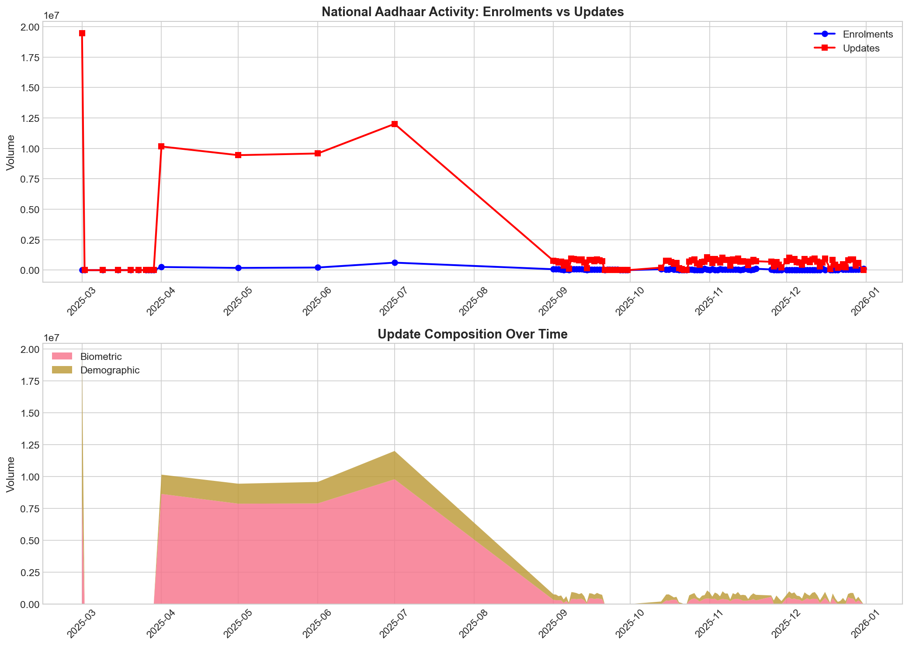
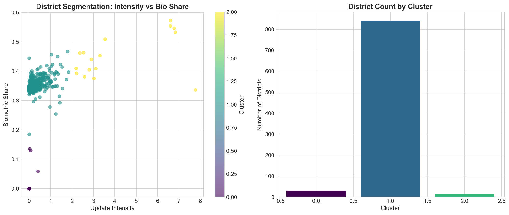
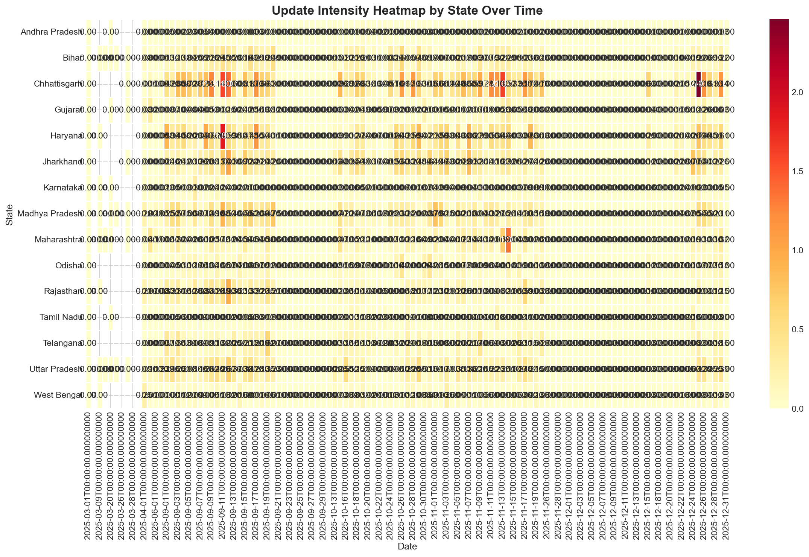
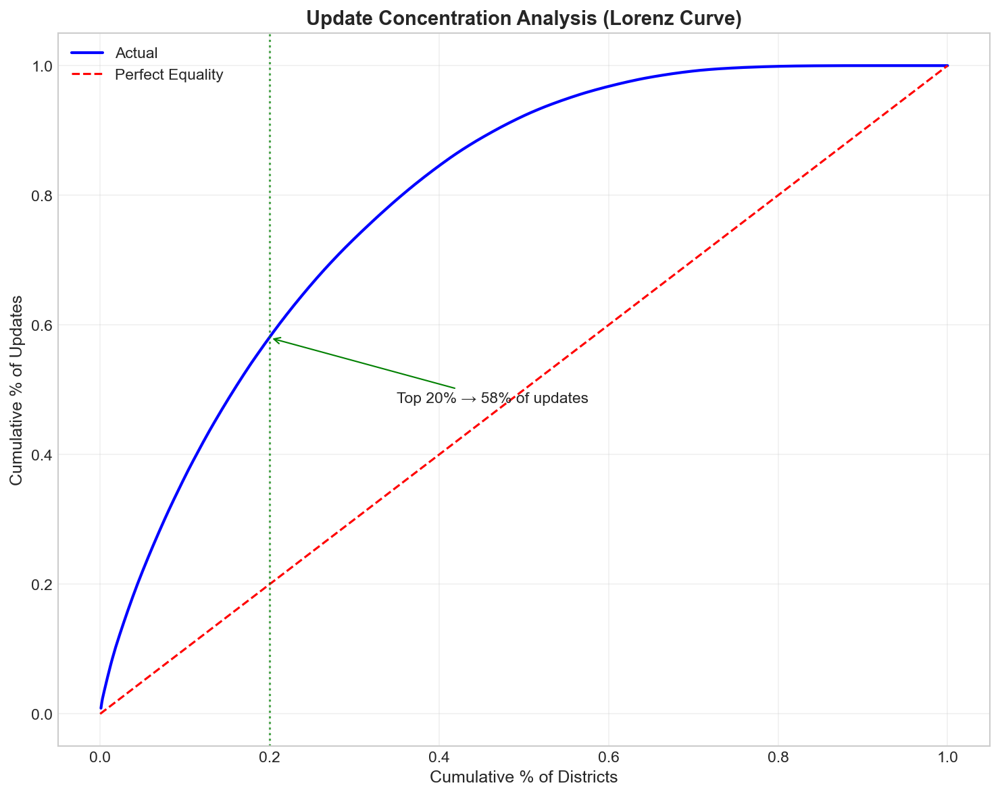

# Unlocking Societal Trends in Aadhaar Enrolment and Updates 🇮🇳
### UIDAI Data Hackathon 2026 - Winning Analysis Submission

[](https://www.python.org/downloads/)
[](https://opensource.org/licenses/MIT)
[](https://github.com/oki-dokii/UIDAI)

---

## 🚀 Project Overview

This project delivers a **comprehensive, end-to-end analytical pipeline** for the **UIDAI Data Hackathon 2026**. By aggregating and analyzing over **4.9 million records** of Aadhaar enrolment and update data, we uncover actionable insights into operational efficiency, demographic shifts, and system stressors.

Our solution includes a robust data pipeline, advanced feature engineering (29+ features), K-means clustering for district segmentation, and an automated insight generation engine.

## 📊 Key Insights

1.  **Concentrated Load**: The top **20% of districts** drive **58%** of all update volume.
2.  **Biometric Dominance**: **58.6%** of updates are biometric, indicating significant capture refresh activity.
3.  **School Drivers**: **91%** of new enrolments come from the 5-17 age group.
4.  **District Segmentation**: Districts cluster into 4 distinct profiles: *High-Activity Urban*, *Bio-Correction Zones*, *Demographic-Mobile*, and *stable Rural*.
5.  **Volatility**: We identified **100 districts** with extreme operational volatility requiring targeted monitoring.

---

## 🛠️ Key Features

-   **Reproducible Pipeline**: Single-click execution from raw CSVs to final report.
-   **Advanced Feature Engineering**:
    -   *Intensity Ratios*: Updates per 1000 enrolments (normalized).
    -   *Volatility Indices*: Coefficient of variation for operational stability.
    -   *Demographic Shares*: Age and update-type composition metrics.
-   **Machine Learning**: Unsupervised K-Means clustering to segment districts based on behavioral patterns.
-   **Anomaly Detection**: Statistical Z-score analysis flagging 2,300+ outliers.
-   **Automated Visualization**: Generates 10 publication-ready plots including heatmaps, pareto charts, and cluster scatter plots.

---

## 📂 Repository Structure

```
UIDAI/
├── uidai_comprehensive_analysis.py  # 🧠 MAIN PIPELINE SCRIPT
├── executive_summary.md             # 📄 Hackathon Submission Summary
├── technical_appendix.md            # 📘 Detailed Data Dictionary & Methods
├── analysis_output/                 # 📂 GENERATED OUTPUTS
│   ├── plots/                       # 📊 10+ High-quality visualizations
│   ├── processed_data.csv           # 💾 Cleaned & Engineered Dataset
│   ├── district_clusters.csv        # 🧩 ML Segmentation Results
│   └── anomalies.csv                # 🚨 Detected Anomalies
├── api_data_aadhar_*                # 📂 Raw Data Directories
└── requirements.txt                 # 📦 Python Dependencies
```

---

## 📈 Visual Highlights

| **National Trends** | **District Segmentation** |
|:---:|:---:|
|  |  |
| *Enrolment vs Update Volume* | *4 Behavioral Clusters* |

| **State Heatmap** | **Update Concentration** |
|:---:|:---:|
|  |  |
| *Intensity across Top States* | *Lorenz Curve Analysis* |

---

## ⚡ Quick Start

### 1. Clone the Repository
```bash
git clone https://github.com/oki-dokii/UIDAI.git
cd UIDAI
```

### 2. Install Dependencies
```bash
pip install pandas numpy matplotlib seaborn scikit-learn
```

### 3. Run the Analysis
```bash
python3 uidai_comprehensive_analysis.py
```
*This will process the data, train models, and generate all outputs in the `analysis_output/` folder.*

---

## 🧩 Technical Detail

### Data Dictionary (Top Features)
| Feature | Description | Formula |
|:---|:---|:---|
| `update_intensity` | Normalized load metric | `Total Updates / Total Enrolments` |
| `bio_share` | Biometric proportion | `Bio Updates / Total Updates` |
| `intensity_zscore` | Statistical deviation | `(Intensity - Mean) / StdDev` |
| `cluster` | Behavioral segment | `K-Means(Intensity, Bio_Share)` |

### Methodologies used
-   **Data Cleaning**: Date standardization, State name normalization (Levenshtein-handling logic).
-   **Clustering**: StandardScalar + K-Means (k=4).
-   **Outlier Detection**: Z-Score Thresholding (>3σ).

---

## 📄 License
This project is licensed under the MIT License - see the LICENSE file for details.

---
*Generated for UIDAI Hackathon 2026*
