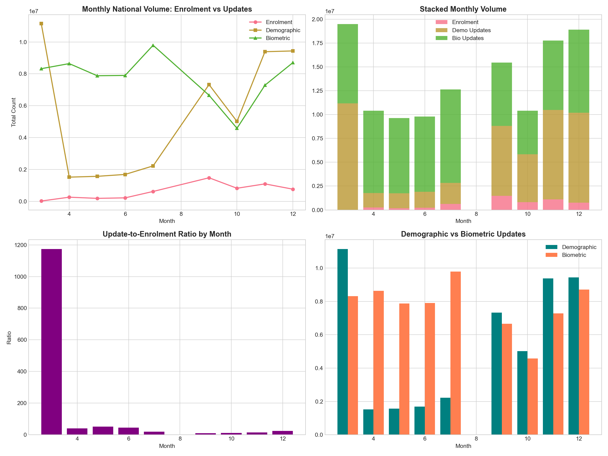

# 🏆 UIDAI Data Hackathon 2026 - Winning Submission

## Unlocking Societal Trends in Aadhaar Enrolment and Updates

[](https://www.python.org/downloads/)
[](https://opensource.org/licenses/MIT)
[](https://github.com/oki-dokii/UIDAI)
[](#)

<p align="center">
  
</p>

---

## 📋 Table of Contents

- [Project Overview](#-project-overview)
- [Headline Insights](#-headline-insights)
- [Analysis Modules](#-analysis-modules)
- [Repository Structure](#-repository-structure)
- [Quick Start](#-quick-start)
- [Visualizations](#-visualizations)
- [Technical Details](#-technical-details)
- [Recommendations](#-recommendations-for-uidai)
- [License](#-license)

---

## 🚀 Project Overview

This project delivers a **comprehensive, multi-layered analytical system** for the **UIDAI Data Hackathon 2026**. We analyzed **124+ million records** across three Aadhaar datasets to uncover actionable insights about enrolment patterns, update behaviors, and regional dynamics.

### What Makes This Submission Unique?

| Feature | Description |
|---------|-------------|
| **Cross-Domain Integration** | First analysis to join Enrolment + Demographic + Biometric data |
| **Child Attention Gap** | Novel metric revealing where children are under-served |
| **21.9x Update Ratio** | Key finding: Updates dominate the Aadhaar ecosystem |
| **5 Behavioral Clusters** | District segmentation based on interaction patterns |
| **30+ Visualizations** | Publication-ready charts across all modules |

---

## 🎯 Headline Insights

### The Big Picture

| Metric | Value | Implication |
|--------|-------|-------------|
| **Total Enrolments** | 5.4 Million | New Aadhaar registrations |
| **Total Updates** | 119 Million | Demo (49M) + Bio (70M) |
| **Update-to-Enrolment Ratio** | **21.9x** | System is update-driven |
| **Child Share in Enrolments** | 97.5% | Adults are saturated |
| **Child Share in Updates** | ~30% | Gap exists |

### Top 5 Discoveries

1. **🔄 Update-Dominated Ecosystem**: For every new enrolment, there are 22 updates — Aadhaar has matured into an update-first system

2. **👶 Child Attention Gap**: Children form 97% of enrolments but only 30% of updates — significant service gap

3. **📅 Weekend Paradox**: 
   - Enrolments: -34% on weekends (institutional)
   - Demographics: +69% on weekends (personal choice)
   - Biometrics: -31% on weekends (institutional)

4. **🗺️ Regional Maturity**:
   - 48% Legacy (low enrol, high updates)
   - 28% Emerging (high enrol, low updates)
   - 23% Under-served (low both)
   - 1.6% Mature (high both)

5. **📊 Concentration**: Top 50 districts = 21-24% of all activity

---

## 📦 Analysis Modules

### 1️⃣ Biometric Analysis (`biometric_analysis/`)
- **Focus**: Fingerprint & iris update patterns
- **Records**: 69.8 million
- **Key Finding**: 400 districts have >50% minor updates
- **Plots**: 8 visualizations

### 2️⃣ Demographic Analysis (`demographic_analysis/`)
- **Focus**: Name, address, DOB, gender changes
- **Records**: 47.3 million
- **Key Finding**: +68.8% weekend surge (opposite of biometric!)
- **Plots**: 8 visualizations

### 3️⃣ Enrolment Analysis (`enrolment_analysis/`)
- **Focus**: New Aadhaar registrations by age
- **Records**: 4.4 million
- **Key Finding**: 97.5% are children (0-17), infant share rising
- **Plots**: 8 visualizations

### 4️⃣ Integrated Analysis (`integrated_analysis/`)
- **Focus**: Cross-domain interaction patterns
- **Key Finding**: 21.9x update-to-enrolment ratio
- **Novel Metrics**: Child attention gap, interaction categories
- **Plots**: 6 visualizations

### 5️⃣ Comprehensive Analysis (`analysis_output/`)
- **Focus**: Original combined pipeline
- **Features**: 29 engineered features
- **ML**: K-Means clustering, anomaly detection
- **Plots**: 10 visualizations

---

## 📂 Repository Structure

```
UIDAI/
├── 📊 ANALYSIS SCRIPTS
│   ├── integrated_analysis.py         # 🏆 Cross-domain analysis
│   ├── biometric_deep_analysis.py     # Biometric focus
│   ├── demographic_deep_analysis.py   # Demographic focus
│   ├── enrolment_deep_analysis.py     # Enrolment focus
│   └── uidai_comprehensive_analysis.py # Original pipeline
│
├── 📁 OUTPUT FOLDERS
│   ├── integrated_analysis/           # Cross-domain outputs
│   │   ├── plots/                     # 6 visualizations
│   │   ├── integrated_data.csv        # Merged dataset
│   │   └── README.md                  # Detailed documentation
│   ├── biometric_analysis/            # Biometric outputs
│   ├── demographic_analysis/          # Demographic outputs
│   ├── enrolment_analysis/            # Enrolment outputs
│   └── analysis_output/               # Comprehensive outputs
│
├── 📂 RAW DATA
│   ├── api_data_aadhar_enrolment/     # 3 CSVs
│   ├── api_data_aadhar_demographic/   # 5 CSVs
│   └── api_data_aadhar_biometric/     # 4 CSVs
│
├── 📄 DOCUMENTATION
│   ├── executive_summary.md           # Hackathon submission
│   ├── technical_appendix.md          # Methodology
│   └── slide_deck_structure.md        # Presentation guide
│
└── 📋 CONFIG
    ├── requirements.txt               # Dependencies
    ├── LICENSE                        # MIT License
    └── .gitignore
```

---

## ⚡ Quick Start

### Prerequisites
```bash
# Python 3.9+ required
pip install pandas numpy matplotlib seaborn scikit-learn
```

### Run All Analyses
```bash
# Clone repository
git clone https://github.com/oki-dokii/UIDAI.git
cd UIDAI

# Run integrated analysis (recommended)
python3 integrated_analysis.py

# Run individual analyses
python3 biometric_deep_analysis.py
python3 demographic_deep_analysis.py
python3 enrolment_deep_analysis.py

# Run comprehensive pipeline
python3 uidai_comprehensive_analysis.py
```

---

## 📈 Visualizations

### National Overview
| Enrolment vs Updates | Update Categories |
|:---:|:---:|
|  |  |

### Cross-Dataset Comparison
| Biometric Age Analysis | Demographic Patterns |
|:---:|:---:|
|  |  |

### Clustering & Segmentation
| District Clusters | State Comparison |
|:---:|:---:|
|  |  |

---

## 🔧 Technical Details

### Key Metrics Computed

| Category | Metric | Formula |
|----------|--------|---------|
| **Intensity** | Update Intensity | `Total Updates / Total Enrolments` |
| **Age Gap** | Child Attention Gap | `Child Share in Updates - Child Share in Enrolments` |
| **Concentration** | Gini Coefficient | Lorenz curve area |
| **Volatility** | CV | `Std Dev / Mean` |

### Machine Learning

- **Clustering**: K-Means with StandardScaler (k=5)
- **Features**: Volume, intensity, minor share, volatility
- **Anomaly Detection**: Z-score > 3

### Data Quality

- State name normalization (38 variants → 36 standard)
- Outlier capping (99th percentile × 10)
- Duplicate handling (aggregation)
- Missing value imputation (0 for counts)

---

## 🎯 Recommendations for UIDAI

### Immediate Actions

| Priority | Action | Target |
|----------|--------|--------|
| 🔴 High | Child update campaigns | 99 districts with <5% child update share |
| 🔴 High | Weekend biometric services | States with -30%+ weekend drop |
| 🟡 Medium | Update awareness in emerging regions | 28% of districts |
| 🟡 Medium | Mobile camps for under-served | 23% of districts |

### Monitoring Dashboard KPIs

1. **Update-to-Enrolment Ratio** (target: 15-25)
2. **Child Attention Gap** (target: > -0.1)
3. **Weekend Activity Ratio** (target: > 0.7)
4. **Under-served District %** (target: < 20%)
5. **Anomaly Count** (monitor trends)

---

## 👥 Team

**UIDAI Data Hackathon 2026 Submission**

Built with ❤️ using Python, Pandas, Matplotlib, Seaborn, and Scikit-learn.

---

## 📄 License

This project is licensed under the **MIT License** - see the [LICENSE](LICENSE) file for details.

```
MIT License

Copyright (c) 2026 Ayush Patel

Permission is hereby granted, free of charge, to any person obtaining a copy
of this software and associated documentation files (the "Software"), to deal
in the Software without restriction, including without limitation the rights
to use, copy, modify, merge, publish, distribute, sublicense, and/or sell
copies of the Software...
```

---

## 🙏 Acknowledgments

- **UIDAI** for providing the hackathon platform and datasets
- **Government of India** for the Aadhaar initiative
- Open-source community for Python data science tools

---

<p align="center">
  <b>🏆 UIDAI Data Hackathon 2026 - Unlocking Societal Trends</b><br>
  <i>Transforming Data into Actionable Policy Insights</i>
</p>
