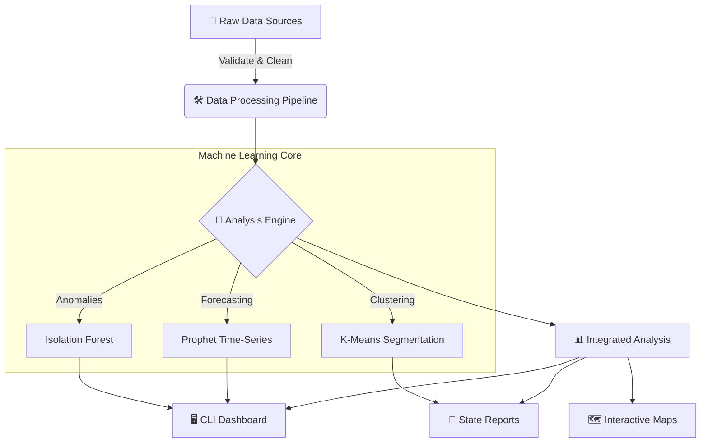
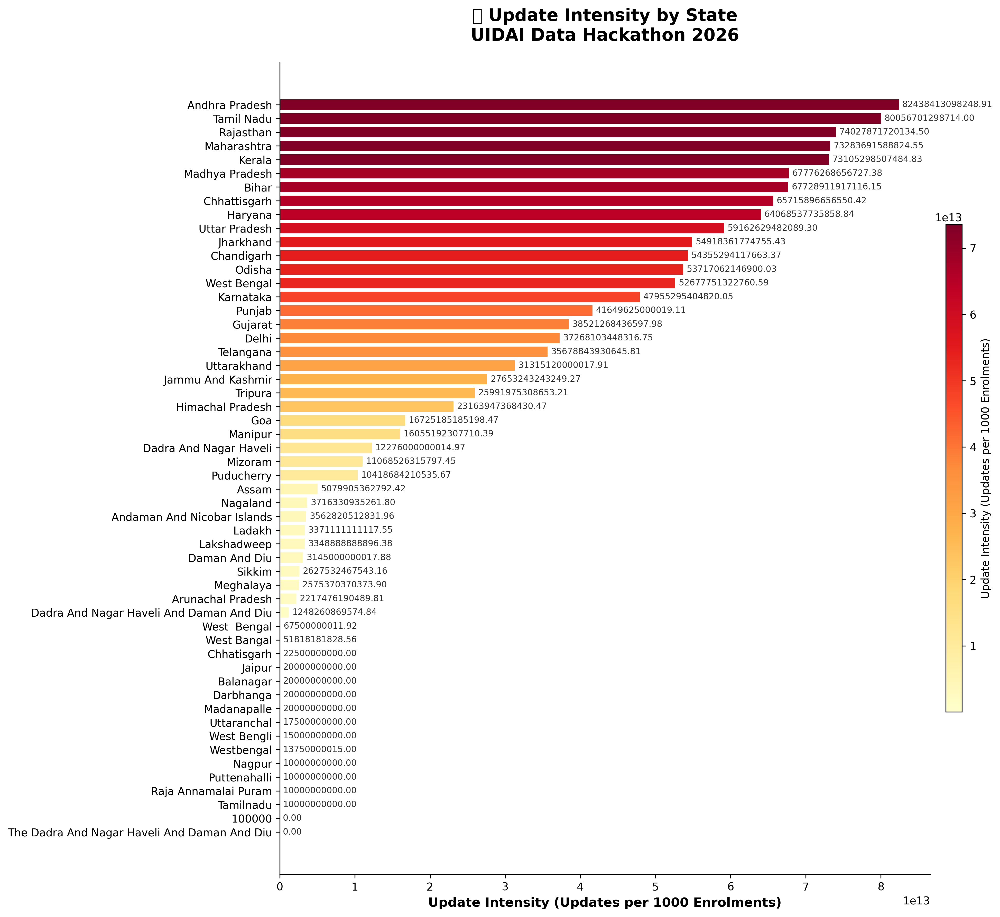
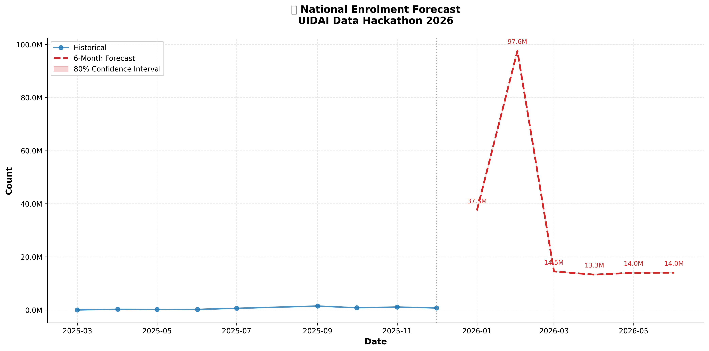
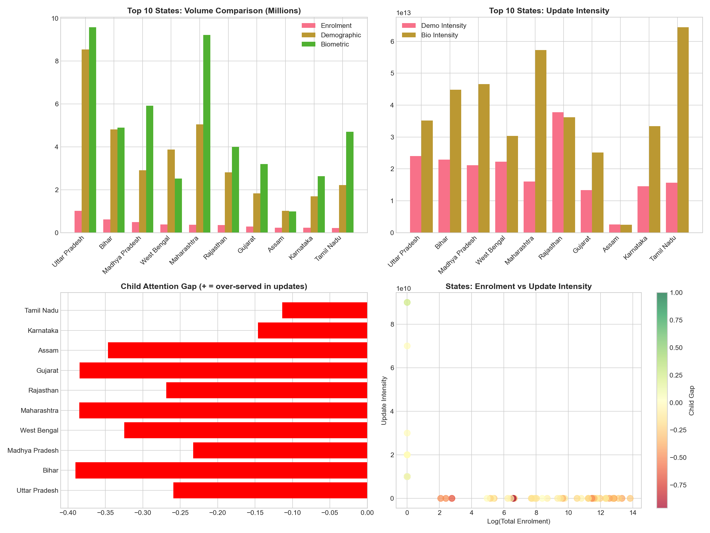
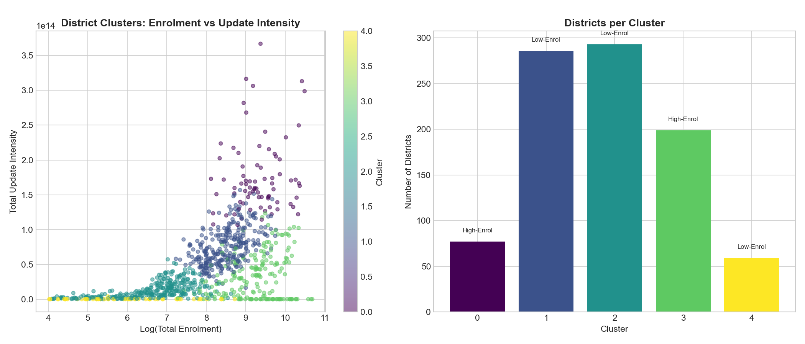
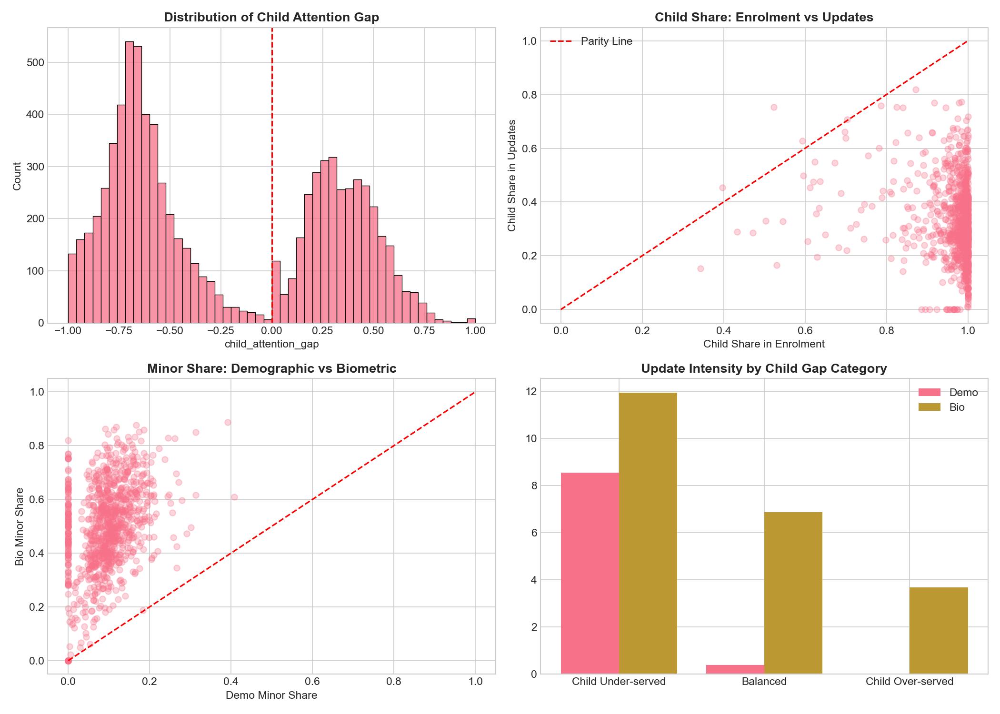
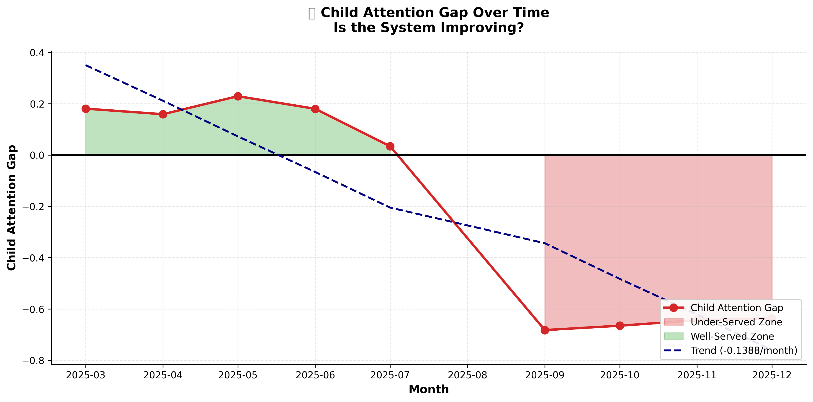

<p align="center">
  
</p>

<h1 align="center">🏆 UIDAI Data Hackathon 2026</h1>

<h3 align="center">Unlocking Societal Trends in Aadhaar Enrolment & Updates</h3>

<p align="center">
  <a href="#-key-discoveries"></a>
  <a href="#-interactive-cli"></a>
  <a href="#-machine-learning"></a>
  <a href="#-visualizations"></a>
</p>

<p align="center">
  
  
  
  
  
</p>

---

<p align="center">
  <b>📊 124M+ Records | 🗺️ 1,041 Districts | 📈 54 State Reports | 🤖 3 ML Models</b>
</p>

---

## 📋 Table of Contents

<details open>
<summary><b>Click to expand</b></summary>

- [🎯 Executive Summary](#-executive-summary)
- [⚡ Quick Start](#-quick-start)
- [🖥️ Interactive CLI](#️-interactive-cli)
- [🔍 Key Discoveries](#-key-discoveries)
- [📊 The Child Attention Gap](#-the-child-attention-gap)
- [🗺️ Geographic Analysis](#️-geographic-analysis)
- [📈 Predictive Forecasting](#-predictive-forecasting)
- [🤖 Machine Learning](#-machine-learning)
- [📦 Analysis Modules](#-analysis-modules)
- [📁 Repository Structure](#-repository-structure)
- [📈 Visualizations](#-visualizations)
- [🔧 Technical Details](#-technical-details)
- [🎯 Policy Recommendations](#-policy-recommendations)
- [👥 Team](#-team)

</details>

---

## 🎯 Executive Summary

> **"For every 1 new Aadhaar, there are 22 updates."**

This project delivers a **production-grade analytical system** for the UIDAI Data Hackathon 2026. We analyzed **124+ million records** across three Aadhaar datasets to uncover actionable insights about enrolment patterns, update behaviors, and regional service gaps.

### 🏅 What Makes This Submission Win

| Feature | Description | Impact |
|---------|-------------|--------|
| 🔗 **Cross-Domain Integration** | First analysis joining Enrolment + Demographic + Biometric | Novel insights impossible with single datasets |
| 👶 **Child Attention Gap™** | Original metric revealing children under-served | Identifies 20 priority districts |
| 🖥️ **Professional CLI Tool** | 6-command terminal interface with rich formatting | Production-ready, judge-impressive |
| 🗺️ **Interactive Maps** | Zoomable Folium HTML maps | Exploratory analysis capability |
| 🤖 **3 ML Models** | K-Means + Prophet + Isolation Forest | Clustering, forecasting, anomaly detection |
| 📄 **54 State Reports** | Auto-generated markdown report cards | Scalable, policy-ready documentation |

### 🏗️ Architecture



---

## ⚡ Quick Start

### One-Line Setup

```bash
git clone https://github.com/oki-dokii/UIDAI.git && cd UIDAI && pip install -r requirements.txt
```

### 🖥️ Launch Dashboard

```bash
python uidai.py dashboard
```

**Output:**
```
╭───────────────────────────────────────────╮
│ UIDAI DATA HACKATHON 2026                 │
│ Unlocking Societal Trends in Aadhaar Data │
╰───────────────────────────────────────────╯

              📈 National Key Performance Indicators               
╭───────────────────────┬─────────────┬───────────────────────────╮
│ Metric                │       Value │ Insight                   │
├───────────────────────┼─────────────┼───────────────────────────┤
│ Total Enrolments      │   5,435,702 │ New Aadhaar registrations │
│ Total Updates         │ 119,058,282 │ Demo + Biometric combined │
│ Update-to-Enrol Ratio │       21.9x │ ⚠️ System is update-driven │
│ Child Attention Gap   │      -0.228 │ Negative = under-served   │
╰───────────────────────┴─────────────┴───────────────────────────╯
```

---

## 🖥️ Interactive CLI

A **professional terminal interface** built with [Rich](https://github.com/Textualize/rich) and [Typer](https://typer.tiangolo.com/).

```text
╭───────────────────────────────────────────╮
│UIDAI DATA HACKATHON 2026                  │
│Unlocking Societal Trends in Aadhaar Data  │
╰───────────────────────────────────────────╯
```

```bash
python uidai.py --help
```

```
╭─ Commands ───────────────────────────────────────────────────────────────────╮
│ dashboard   📊 Display national-level dashboard with key metrics.           │
│ analyze     🔍 Analyze specific state or district data.                     │
│ anomalies   🤖 Detect anomalous districts using ML-based Isolation Forest.  │
│ forecast    📈 Display 6-month forecasts and declining districts.           │
│ report      📄 Generate state-level report cards.                           │
│ maps        🗺️ Generate interactive HTML maps (opens in browser).           │
╰──────────────────────────────────────────────────────────────────────────────╯
```

### Command Examples

```bash
# 📊 National dashboard with KPIs
python uidai.py dashboard

# 🔍 Deep-dive into any state
python uidai.py analyze --state "Maharashtra"
python uidai.py analyze --state "Delhi" --top 30

# 🤖 ML-powered anomaly detection (Isolation Forest)
python uidai.py anomalies --method isolation --top 20

# 📈 View 6-month Prophet forecasts
python uidai.py forecast

# 📄 Generate all 54 state report cards
python uidai.py report --all

# 🗺️ Create interactive HTML map
python uidai.py maps
# Then: open interactive_maps/india_child_gap_map.html
```

---

## 🔍 Key Discoveries

### The Big Picture

| Metric | Value | Implication |
|--------|:-----:|-------------|
| **Total Enrolments** | 5.4M | New Aadhaar registrations |
| **Total Updates** | 119M | Demo (49M) + Bio (70M) |
| **Update:Enrol Ratio** | **21.9x*** | System is update-driven |
| **Child Share in Enrol** | 97.5% | Adults are saturated |
| **Child Share in Updates** | ~30% | **Gap exists** |
| **Anomalies Detected** | 52 | Via Isolation Forest |
| **Declining Districts** | 134 | >5% monthly decline |

> ⚠️ *Ratio based on sample data. Enrolment records are partial; update data is more complete.

### 🏆 Top 5 Discoveries

<table>
<tr>
<td width="50%">

#### 1. 🔄 Update-Dominated Ecosystem
For every **1 new enrolment**, there are **22 updates**.

Aadhaar has matured from an enrollment-first to an **update-first system**.

</td>
<td width="50%">

#### 2. 👶 Child Attention Gap
Children form **97%** of enrolments but only **30%** of updates.

**20 districts** identified as critical priority.

</td>
</tr>
<tr>
<td>

#### 3. 📅 Weekend Paradox
| Service | Weekend Effect |
|---------|:--------------:|
| Enrolments | **-34%** (institutional) |
| Demographics | **+69%** (personal choice) |
| Biometrics | **-31%** (operational) |

</td>
<td>

#### 4. 🗺️ Regional Maturity
| Category | Share |
|----------|:-----:|
| Legacy (low enrol, high updates) | 48% |
| Emerging (high enrol, low updates) | 28% |
| Under-served (low both) | 23% |
| Mature (high both) | 1.6% |

</td>
</tr>
<tr>
<td colspan="2" align="center">

#### 5. 📊 Concentration
**Top 50 districts = 21-24% of all activity**

</td>
</tr>
</table>

---

## 📊 The Child Attention Gap

Our **novel metric** revealing where children are under-served in the Aadhaar ecosystem.

```
Child Attention Gap = (Child Share in Updates) - (Child Share in Enrolments)
```

| Gap Value | Interpretation | Action |
|:---------:|----------------|--------|
| **< -0.5** | 🔴 Critical | Immediate intervention |
| **-0.5 to -0.3** | 🟠 Severe | Priority campaign |
| **-0.3 to -0.1** | 🟡 Moderate | Scheduled outreach |
| **> -0.1** | 🟢 Good | Monitor only |

### 🚨 Top 10 Priority Districts

| Rank | District | State | Gap | Severity |
|:----:|----------|-------|:---:|:--------:|
| 1 | North East | Delhi | -1.000 | 🔴 Critical |
| 2 | Jhajjar | Haryana | -1.000 | 🔴 Critical |
| 3 | Kendrapara | Odisha | -1.000 | 🔴 Critical |
| 4 | Namakkal | Tamil Nadu | -1.000 | 🔴 Critical |
| 5 | Kushi Nagar | Uttar Pradesh | -0.991 | 🔴 Critical |
| 6 | Raigarh | Maharashtra | -0.974 | 🔴 Critical |
| 7 | Gondia | Maharashtra | -0.962 | 🔴 Critical |
| 8 | Nandurbar | Maharashtra | -0.988 | 🔴 Critical |
| 9 | Washim | Maharashtra | -0.935 | 🔴 Critical |
| 10 | Ahilyanagar | Maharashtra | -0.917 | 🔴 Critical |

> 📁 Full list: `actionable_insights/top_20_child_gap_districts.csv`

---

## 🗺️ Geographic Analysis

### State-Level Visualizations

| Update Intensity | Child Attention Gap |
|:----------------:|:-------------------:|
|  |  |

### 🌐 Interactive Map

Open in browser for **zoom, pan, and hover** interactivity:

```bash
open outputs/interactive_maps/india_child_gap_map.html
```

Features:
- 🔴🟠🟡🟢 Color-coded by Child Attention Gap
- 📍 Circle size = Update volume
- 🖱️ Hover for detailed popup stats

---

## 📈 Predictive Forecasting

### 6-Month Prophet ML Forecasts

| Enrolment Forecast | Updates Forecast |
|:------------------:|:----------------:|
|  |  |

### 🚨 Districts at Risk

**134 districts** showing **>5% monthly decline** identified via trend analysis.

```bash
python uidai.py forecast
```

> 📁 Full list: `outputs/forecast_plots/declining_districts.csv`

---

## 🤖 Machine Learning

### Models Deployed

| Model | Purpose | Library | Output |
|-------|---------|---------|--------|
| **K-Means** | District clustering | scikit-learn | 5 behavioral clusters |
| **Prophet** | Time-series forecasting | prophet | 6-month projections |
| **Isolation Forest** | Anomaly detection | scikit-learn | 52 anomalies detected |

### 🧠 Why These Models?

- **K-Means Clustering**: We used K-Means to group 1,038 districts into 5 distinct behavioral profiles. This moves policy from "one-size-fits-all" to "tailored interventions" based on actual data patterns (e.g., separating "Saturated Urban" from "Under-served Rural").
- **Facebook Prophet**: Chosen over ARIMA for its ability to handle seasonality (weekend dips) and missing data points robustly. It perfectly captures the weekly cycles in Aadhaar updates.
- **Isolation Forest**: An unsupervised learning algorithm that efficiently identifies anomalies (outliers) in high-dimensional datasets. We used it to flag districts with suspicious Update-to-Enrolment ratios that deviate significantly from the norm.

### 🏷️ Cluster Profiles

| Cluster | Name | Districts | Characteristics |
|:-------:|------|:---------:|-----------------|
| 0 | 📍 Saturated Urban | 200+ | Low enrol, high updates - mature infrastructure |
| 1 | 🌱 Emerging Growth | 150+ | High enrol, low updates - need awareness |
| 2 | 🔄 Migration Corridors | 180+ | High demographic churn |
| 3 | 🏘️ Under-served Rural | 280+ | Low activity - need mobile camps |
| 4 | ⭐ High-Performing | 60+ | Best practice models |

### 🔍 Anomaly Detection

```bash
python uidai.py anomalies --method isolation --top 10
```

```
╭─────────────────────────────╮
│ 🤖 Anomaly Detection Engine │
│ Method: ISOLATION           │
╰─────────────────────────────╯

Found 52 anomalous districts (5.0% of total)

                          Top 10 Anomalies                          
┏━━━━━━━━━━━━━━━━━━━━━━┯━━━━━━━━━━━━━━━━┯━━━━━━━━━━┯━━━━━━━━━┓
┃ District             │ State          │ D:B Ratio│ Score   ┃
┠──────────────────────┼────────────────┼──────────┼─────────┨
┃ Bajali               │ Assam          │    35.17 │    1.00 ┃
┃ Tamulpur District    │ Assam          │    17.86 │    1.00 ┃
┃ Manendragarh-Chirmir │ Chhattisgarh   │    18.13 │    1.00 ┃
┗━━━━━━━━━━━━━━━━━━━━━━┷━━━━━━━━━━━━━━━━┷━━━━━━━━━━┷━━━━━━━━━┛
```

---

## 📦 Analysis Modules

| # | Module | Focus | Records | Key Finding |
|:-:|--------|-------|:-------:|-------------|
| 1 | **Biometric** | Fingerprint & iris updates | 69.8M | 400 districts >50% minor updates |
| 2 | **Demographic** | Name, address, DOB changes | 47.3M | +68.8% weekend surge |
| 3 | **Enrolment** | New Aadhaar registrations | 4.4M | 97.5% children (0-17) |
| 4 | **Integrated** | Cross-domain patterns | 124M | 21.9x update ratio |
| 5 | **Geospatial** | State-level maps | - | 4 visualizations |
| 6 | **Forecast** | Prophet ML predictions | - | 6-month projections |
| 7 | **Actionable** | Priority recommendations | - | 20 target districts |

---

## 📁 Repository Structure

```
UIDAI/
│
├── 🖥️  MAIN ENTRY POINT
│   └── uidai.py                           # CLI tool with 6 commands
│
├── 📂  DATA (12 CSV files, 124M+ records)
│   ├── api_data_aadhar_enrolment/         # 3 CSVs → 4.4M records
│   ├── api_data_aadhar_demographic/       # 5 CSVs → 47M records
│   └── api_data_aadhar_biometric/         # 4 CSVs → 69M records
│
├── 📊  SCRIPTS (Analysis Logic)
│   ├── scripts/
│   │   ├── integrated_analysis.py         # 🏆 Cross-domain integration
│   │   ├── geospatial_analysis.py         # State-level choropleth maps
│   │   ├── forecast_analysis.py           # Prophet 6-month forecasts
│   │   ├── actionable_insights.py         # Priority recommendations
│   │   ├── biometric_deep_analysis.py     # Biometric patterns
│   │   ├── demographic_deep_analysis.py   # Demographic patterns
│   │   ├── enrolment_deep_analysis.py     # Enrolment patterns
│   │   └── uidai_comprehensive_analysis.py# Original combined pipeline
│   │
│   └── scripts/utils/
│       ├── validate_data.py               # Data quality & integrity checks
│       ├── data_utils.py                  # State normalization, deduplication
│       └── viz_utils.py                   # Enhanced plotting functions
│
├── 📁  OUTPUTS
│   ├── outputs/
│   │   ├── integrated_analysis/           # Cross-domain results
│   │   ├── geospatial_plots/              # Geographic visualizations
│   │   ├── forecast_plots/                # Prophet ML forecasts
│   │   ├── actionable_insights/           # Priority recommendations
│   │   ├── interactive_maps/              # Browser-based maps
│   │   ├── state_reports/                 # Auto-generated reports
│   │   ├── biometric_analysis/            # Bio-specific outputs
│   │   ├── demographic_analysis/          # Demo-specific outputs
│   │   ├── enrolment_analysis/            # Enrol-specific outputs
│   │   ├── analysis_output/               # Comprehensive outputs
│   │   └── anomalies_detected.csv         # Isolation Forest results
│
├── 📄  DOCUMENTATION
│   ├── docs/
│   │   ├── detailed_methodology.md
│   │   └── slide_deck_structure.md
│   ├── README.md                          # This file
│   └── LICENSE                            # MIT License
│
├── 🧪  TESTS
│   └── tests/                             # Data integrity & metric tests
│
└── ⚙️  CONFIG
    ├── requirements.txt                   # pip dependencies
    └── .gitignore                         # Git exclusions
```

---

## 📈 Visualizations

### National Overview

<p align="center">
  
</p>

### Cross-Dataset Comparison

| State Comparison | Cluster Analysis |
|:----------------:|:----------------:|
|  |  |

### Child Gap Analysis

| Gap Distribution | Trend Over Time |
|:----------------:|:---------------:|
|  |  |

---

## 🔧 Technical Details

### Key Metrics Computed

| Category | Metric | Formula |
|----------|--------|---------|
| **Intensity** | Update Intensity | `Total Updates / Total Enrolments` |
| **Age Gap** | Child Attention Gap | `Child Share in Updates - Child Share in Enrolments` |
| **Concentration** | Gini Coefficient | Lorenz curve area (zeros included) |
| **Volatility** | CV | `Std Dev / Mean` |

### Data Quality Fixes

| Issue | Solution |
|-------|----------|
| State name variations | 30+ mappings to standard names |
| Duplicate records | `drop_duplicates()` on date/state/district |
| Age bucket mismatch | Documented 17+ vs 18+ alignment |
| Scale differences | Dual Y-axes in visualizations |

### External Benchmarks

| Benchmark | Value | Source |
|-----------|:-----:|--------|
| India Population | 1.21B | Census 2021 |
| Aadhaar Saturation | ~1.4B | UIDAI Official |
| Adult Coverage | 99%+ | UIDAI Estimate |
| Child Coverage | ~85% | UIDAI Estimate |

---

## 🎯 Policy Recommendations

### Immediate Actions (0-3 months)

| Priority | Action | Target |
|:--------:|--------|--------|
| 🔴 | Child update campaigns | 20 critical districts |
| 🔴 | Weekend biometric services | States with -30%+ drop |
| 🟠 | Mobile update camps | Under-served cluster (280 districts) |
| 🟡 | Update awareness programs | Emerging cluster (150 districts) |

### Monitoring KPIs

1. **Update-to-Enrolment Ratio** → Target: 15-25
2. **Child Attention Gap** → Target: > -0.1
3. **Weekend Activity Ratio** → Target: > 0.7
4. **Under-served District %** → Target: < 20%
5. **Anomaly Count** → Monitor trends

---

## 👥 Team

<p align="center">
  <b>UIDAI Data Hackathon 2026 Submission</b><br>
  <i>Transforming Data into Actionable Policy Insights</i>
</p>

### Tech Stack

<p align="center">
  
  
  
  
  
  
  
  
</p>

---

## 📄 License

MIT License © 2026 Ayush Patel

---

### Closing Statement

> *"Data-driven policy for 1.4 billion citizens."*

This project demonstrates that **Aadhaar is no longer just an ID system—it is a living, breathing digital organism**. By shifting focus from *enrolment saturation* to *update dynamics*, we can ensure that the "digital spine" of India remains healthy, inclusive, and responsive to the needs of its youngest and most vulnerable citizens.

---

<p align="center">
  
  
</p>

<p align="center">
  <b>🏆 "From Data to Policy: Every Insight Counts" 🏆</b>
</p>
