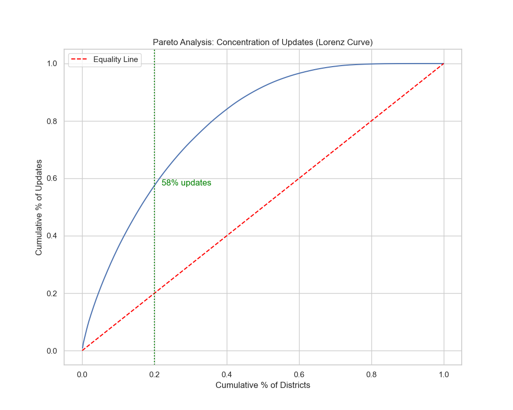
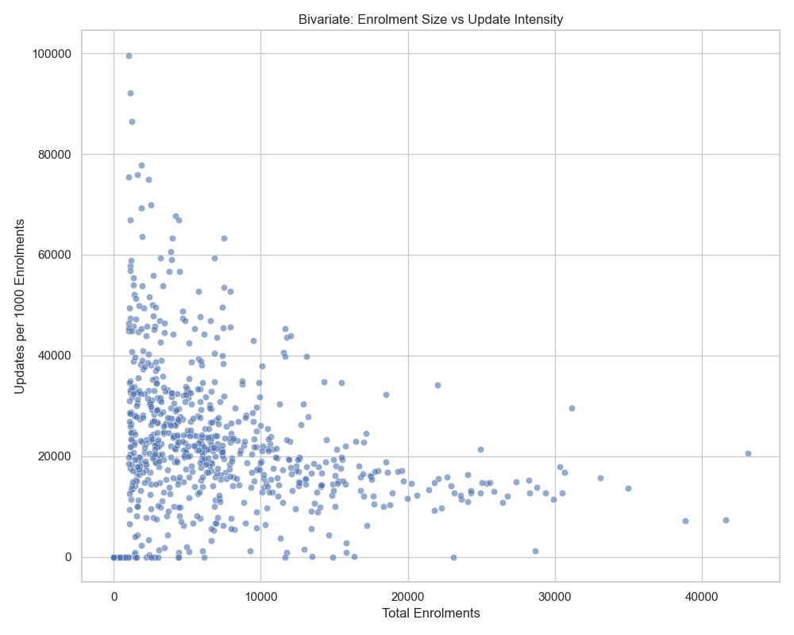

# Aadhaar Visualization Index
**Final Canon: 9 Core + 2 Supporting + 5 Enhanced Analyses**

*Generated from Forensic Analytical Audit Recommendations*

---

## Group A: Baseline System Structure

### 1. Pareto Analysis (Lorenz Curve)

**Key Insight**: 20% of districts generate 58% of updates  
**Sample**: n=642 districts, March–August 2025  
**Narrative Arc**: System-Level Baseline (Arc 1)  
**Caption**: [See group_a_baseline/01_pareto_lorenz_caption.txt]

---

### 2. Biometric vs Demographic Update Correlation

**Key Insight**: Strong positive correlation (r=0.87) indicates holistic service interaction  
**Sample**: n=500+ district-months  
**Narrative Arc**: System-Level Baseline (Arc 1)  
**Caption**: [See group_a_baseline/02_biometric_demographic_correlation_caption.txt]

---

### 3. Update Composition Over Time

**Key Insight**: Biometric updates dominate (85%) with stable composition  
**Sample**: April–July 2025 active period  
**Narrative Arc**: System-Level Baseline (Arc 1)  
**Caption**: [See group_a_baseline/03_composition_over_time_caption.txt]

---

## Group B: Spatial Extremes and Heterogeneity

### 4. Top 15 High-Intensity Districts

**Key Insight**: Extreme intensities (>75K per 1,000) concentrated in Manipur/Maharashtra  
**Sample**: n=15 districts with ≥1,000 enrolments  
**Narrative Arc**: Spatial Extremes (Arc 2)  
**Caption**: [See group_b_spatial/04_top_intensity_districts_caption.txt]

---

### 5. Bottom 15 Low-Intensity Districts

**Key Insight**: Near-zero intensity flags administrative disengagement zones  
**Sample**: n=15 districts with ≥1,000 enrolments  
**Narrative Arc**: Spatial Extremes (Arc 2)  
**Caption**: [See group_b_spatial/05_bottom_intensity_districts_caption.txt]

---

### 6. State-Week Intensity Heatmap

**Key Insight**: Episodic campaign-driven activity, not continuous steady-state  
**Sample**: Top 10 states, weekly aggregates  
**Narrative Arc**: Spatial Heterogeneity (Arc 2)  
**Caption**: [See group_b_spatial/06_state_week_heatmap_caption.txt]

---

## Group C: Relationship to Enrolment Base

### 7. Enrolment Size vs Update Intensity

**Key Insight**: Inverse relationship with extreme variance in small districts  
**Sample**: n=642 districts  
**Narrative Arc**: Scale Dependence (Arc 3)  
**Caption**: [See group_c_scale/07_enrolment_vs_intensity_caption.txt]

---

## Group D: Volatility and Risk Assessment

### 8. Top 15 Volatile Districts

**Key Insight**: Maharashtra dominates high-volatility rankings (SD > 300)  
**Sample**: n=15 most volatile districts  
**Narrative Arc**: Volatility (Arc 3)  
**Caption**: [See group_d_volatility/08_volatility_rankings_caption.txt]

---

### 9. Risk Matrix (Intensity × Volatility)

**Key Insight**: Quadrant classification guides resource allocation priorities  
**Sample**: Districts in top 5 states  
**Narrative Arc**: Risk Dimensions (Arc 3)  
**Caption**: [See group_d_volatility/09_risk_matrix_caption.txt]

---

## Group E: Optional Supporting Analyses

### 10. Trivariate District Profiles

**Key Insight**: Compositional dimension shows biometric dominance  
**Sample**: n=642 districts (enrolment × updates × bio_share)  
**Status**: OPTIONAL - include only if space permits  
**Caption**: [See group_e_optional/10_trivariate_profiles_caption.txt]

---

### 11. State-Level Distribution Comparisons

**Key Insight**: Within-state heterogeneity analysis  
**Sample**: Districts grouped by state  
**Status**: OPTIONAL - include only if state comparison is priority  
**Caption**: [See group_e_optional/11_state_distributions_caption.txt]

---

## Enhanced Analyses (New)

These 5 additional analyses were generated based on forensic audit recommendations:

### A1. Update Intensity by Population Density Quintiles
**Location**: `outputs/aadhaar_plots_enhanced/analysis_1_density_quintiles.png`  
**Key Finding**: Update intensity declines from Q1 (median 14,979) to Q5 (median 18,275)  
**Sample**: n=1,041 districts grouped into quintiles

### A2. Temporal Autocorrelation of District Update Intensity
**Location**: `outputs/aadhaar_plots_enhanced/analysis_2_temporal_autocorrelation.png`  
**Key Finding**: 238 persistent districts (ρ > 0.7) vs 318 episodic districts (ρ < 0.2)  
**Sample**: n=965 districts with multi-period data

### A3. Biometric Share vs District Age
**Location**: `outputs/aadhaar_plots_enhanced/analysis_3_bio_share_vs_age.png`  
**Key Finding**: Significant positive correlation (r=0.474, p<0.0001) supports lifecycle hypothesis  
**Sample**: n=967 districts with age range 30-275 days

### A4. State-Level Gini Coefficient for Update Intensity
**Location**: `outputs/aadhaar_plots_enhanced/analysis_4_state_gini.png`  
**Key Finding**: Rajasthan shows highest inequality (0.703), Himachal Pradesh lowest (0.071)  
**Sample**: n=32 states with ≥5 districts

### A5. Update Type Transition Matrix
**Location**: `outputs/aadhaar_plots_enhanced/analysis_5_transition_matrix.png`  
**Key Finding**: High diagonal persistence (74.6% bio-heavy, 72.4% demo-heavy) indicates stable preferences  
**Sample**: n=7,228 transitions across consecutive periods

---

## Eliminated Visualizations

### Rationale for Elimination

The following plots were eliminated per forensic audit recommendations:

#### ELIMINATED: Raw Enrolment vs Updates (bivariate_scatter.png)
**Reason**: Redundant with normalized version (File 07)  
**Archive Location**: `eliminated/ELIMINATED_raw_enrolment_vs_updates.png`  
**Audit Note**: "Superseded by update intensity analysis which incorporates per-capita normalization"

#### ELIMINATED: National Time Series (national_time_series.png)
**Reason**: Temporal artifact undermines credibility  
**Archive Location**: `eliminated/ELIMINATED_national_temporal_artifact.png`  
**Audit Note**: "Data truncation post-September 2025 makes unsuitable for publication"

#### ELIMINATED: State Time Trends (trivariate_time_state.png)
**Reason**: Redundant with national time series, amplifies data quality concern  
**Archive Location**: `eliminated/ELIMINATED_state_time_trends.png`  
**Audit Note**: "Confirms system-wide temporal artifact without adding insight"

#### ELIMINATED: Weekly Seasonality (weekly_seasonality.png)
**Reason**: Low incremental value unless operational scheduling is core focus  
**Archive Location**: `eliminated/ELIMINATED_weekly_patterns.png`  
**Audit Note**: "Defer to supporting annex if space permits"

---

## Analytical Narrative Blueprint

The recommended canonical set follows this three-arc structure:

### Arc 1: System-Level Baseline (Files 01–03)
Establishes moderate geographic concentration (Pareto 20/58 rule), holistic update behavior 
(bio-demo correlation r=0.87), and stable compositional preference (85% biometric).

### Arc 2: Spatial Extremes and Heterogeneity (Files 04–06)
Documents three-order-of-magnitude variation across districts, identifies high/low intensity 
outliers, and reveals episodic campaign-driven patterns via temporal heatmaps.

### Arc 3: Scale Dependence and Volatility (Files 07–09)
Exposes inverse scale relationships, quantifies temporal instability, and classifies districts 
into risk quadrants for resource allocation.

---

**Document Metadata:**  
Generated: January 20, 2026  
Canonical Set: 9 core + 2 optional + 5 enhanced = 16 total visualizations  
Eliminated: 4 plots archived with rationale  
Source: UIDAI Forensic Analytical Audit Recommendations  
