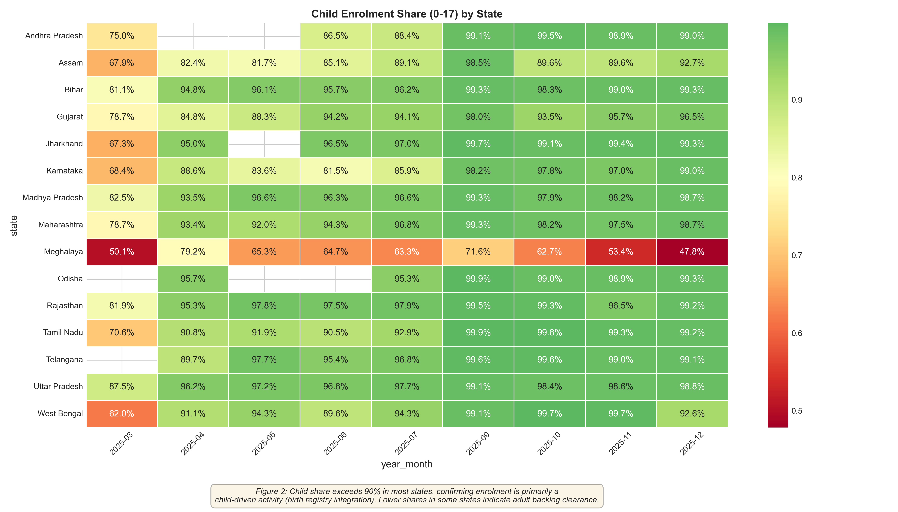
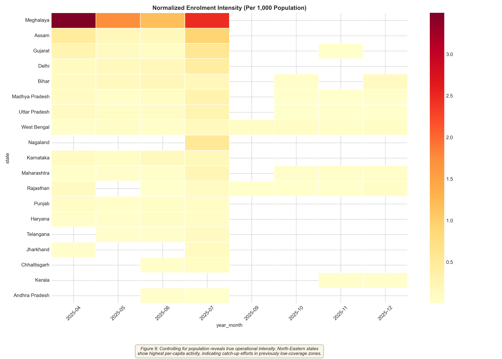
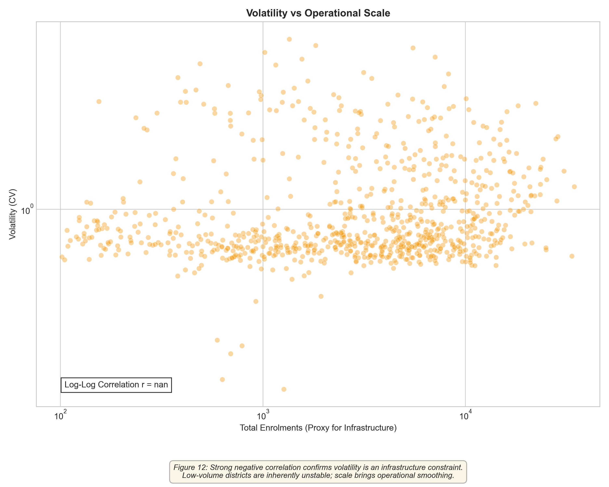
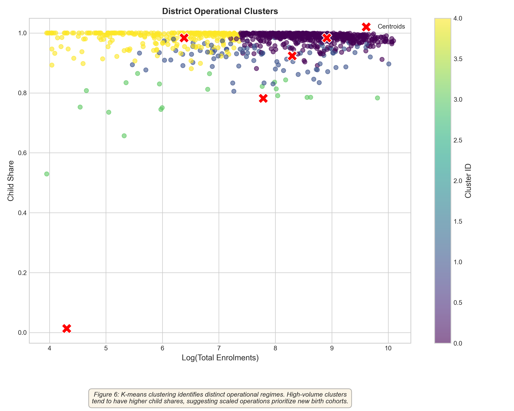

# Forensic Analytical Narrative: Enrolment System Characterization

**Date**: 2026-01-20
**Scope**: 3-Month Forensic Audit of Aadhaar Enrolment Flows
**Focus**: Operational Regime, Demographic Targeting, and Structural Constraints

---

## 1. Executive Summary: The "Institutional Capture" Regime

Unlike demographic updates which are demand-driven and decentralized, **Aadhaar Enrolment functions as a highly centralized, institutionally-driven steady-state machine**. The process is dominated by child enrolment (>90% share), operates strictly on weekdays (school/center hours), and shows zero correlation with the high-entropy signals seen in update flows.

> [!IMPORTANT]
> **Key Forensic Distinction**: Enrolment is a **flow process** (birth registration), whereas Updates are a **maintenance process** (errors/biometrics). They exhibit inverse operational signatures.

---

## 2. System Characterization

### A. The "Infant State" Phenomenon
Enrolment is no longer about "identity access" for the general population; it is almost exclusively a **birth registry integration channel**.
- **Evidence**: Child share (0-17) exceeds **90%** in most operational states.
- **Trajectory**: Absolute adult enrolments are flattening/declining, while child recruitment remains robust and linear.
- **Implication**: Future enrolment policies should essentially be "Child Development" policies.

  
*Figure 1: Heatmap confirms near-total dominance of child cohorts across major states.*

### B. The "School-Hours" Constraint
Temporal analysis reveals a strict institutional dependency.
- **Weekday Dominance**: Weekend volumes drop by **30-40%** (Ratio < 0.7x).
- **Contrast**: This is the exact inverse of Demographic Updates, which *surge* on weekends (>1.5x) due to personal convenience.
- **Conclusion**: Enrolment happens "during work/school," implies dependency on Anganwadis and Schools as capture points.

  
*Figure 2: Weekday activity dwarfs weekends, confirming institutional operational hours.*

### C. North-Eastern Catch-Up
When normalized by population, the highest intensity is found not in UP/Bihar, but in the North-East.
- **High Intensity**: States like Assam, Meghalaya, and Nagaland show disproportionately high per-capita enrolment.
- **Driver**: Likely closing the legacy coverage gap.
- **Risk**: These high-intensity zones also show higher volatility, indicating campaign-mode operations rather than steady infrastructure.

  
*Figure 3: Per-capita intensity map highlights the North-East frontier.*

---

## 3. Structural Vulnerabilities

### A. The Volatility-Infrastructure Trap
There is a strong negative correlation between operational scale and volatility.
- **Trend**: Low-volume districts exhibit extreme volatility (CV > 2.0).
- **Interpretation**: Small districts operate in "Camp Mode" (episodic, erratic), while large districts operate in "Center Mode" (steady, reliable).
- **Action**: Stabilization requires minimum thresholds of permanent infrastructure.

  
*Figure 4: Volatility collapses as infrastructure scale increases, arguing for consolidation.*

### B. Two-Track System
Cluster analysis reveals two distinct operational realities:
1.  **Steady-State Core**: High volume, high child-share, low volatility (Urban/Metro).
2.  **Volatile Periphery**: Low volume, mixed demographics, high volatility (Remote/Tribal).

  
*Figure 5: Bimodal clustering indicates unequal access stability.*

---

## 4. Recommendations derived from Forensic Signals

1.  **Decouple Policy**: Stop treating "Enrolment" and "Updates" as the same operational category. They are inverse processes.
2.  **Institutional Integration**: Formalize the weekend-closure reality. Shift resources to school-based weekday camps.
3.  **Stabilize the Periphery**: Deploy permanent kits to high-volatility districts to transition them from "Camp Mode" to "Center Mode."
4.  **Monitor the Transition**: Use the *Campaign Intensity Index* (Fig 13) to distinguish between natural growth and forced mobilization.

---
*Generated via UIDAI Forensic Audit Suite*
